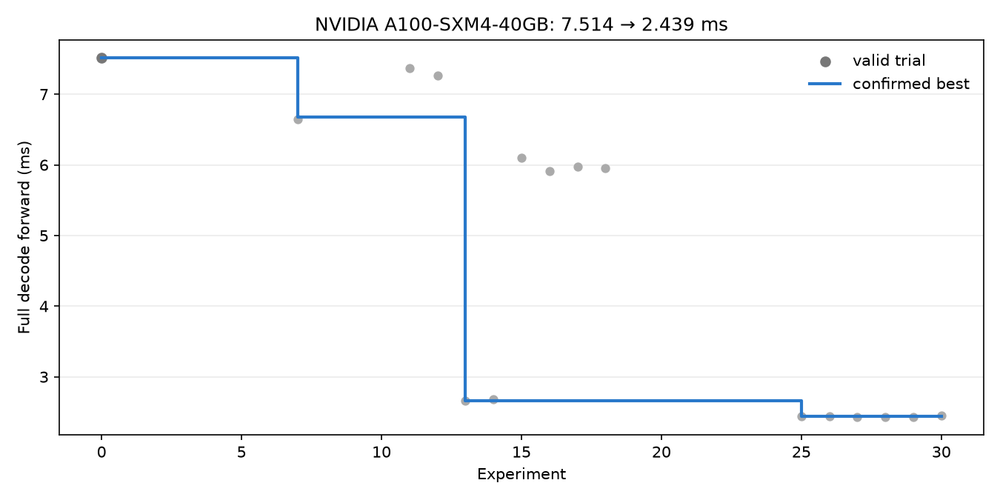

# LLM decode autoresearch — NVIDIA A100-SXM4-40GB

2026-09-27 · Colab CLI 0.7.4 · 30개 후보 · 별도 프로세스 확인 실행 · bf16

시작 후보 **7.5135 ms → 최고 확인 후보 2.4385 ms**: 67.5% 단축, 3.08배.
최고 방법: `graph-rope-preserve-bf16-b128-w4` · 실험 브랜치 커밋 `123039c`.
첫 측정 2.4385 ms, 확인 측정 2.4365 ms 중 느린 값을 최고 기록으로 사용했다.

## 측정 범위

- `colab` preset: B=8, T=1, S=2048, D=2048, F=5632, 8층, 16 query/KV heads, vocabulary 32000.
- 무작위 가중치의 전체 decode forward이며 모든 logits와 KV cache를 계산한다. 고정 context 마지막 슬롯 갱신이고 연속 생성 서비스 측정은 아니다.
- CPU dispatch와 완료 대기를 포함한 동기화 wall-clock 시간이다. 입력 준비와 컴파일은 제외하고 5회 warmup 뒤 10회씩 7라운드 중앙값을 사용한다.
- `atol=rtol=0.02`, 전체 logits·모든 KV cache·정확한 cache prefix 보존·새 가중치/토큰 재검사를 적용했다. 허용 오차는 실험 중 변경하지 않았다.
- 기기별 초기 구현이 다르므로 아래 수치는 각 기기의 시작 후보 대비 개선이다. 서로 다른 장치의 우열을 판정하는 비교가 아니다.
- 패키지: `{"torch": "2.11.0+cu128", "triton": "3.6.0"}`.

## 최종 재검증

| 단계 | 상태 | candidate ms | 같은 실행의 reference ms |
|---|---|---:|---:|
| prefill | ok | 21.0819 | 22.6386 |
| decode | ok | 2.4363 | 6.8778 |

이 최종 실행은 선택된 모델을 새 프로세스에서 다시 검사한 값이며, 위의 두 번 확인된 선택 기록과 별도로 보관한다.

## 모든 시도

상태별 개수: `{"incorrect": 15, "keep": 3, "discard": 12}`. 정확도 실패에는 유효한 성능 점수를 부여하지 않았다.

| # | 방법 | 상태 | 첫 측정 ms | 확인 ms |
|---:|---|---|---:|---:|
| 1 | compile-default | incorrect | — | — |
| 2 | compile-reduce-overhead | incorrect | — | — |
| 3 | sdpa-auto | incorrect | — | — |
| 4 | sdpa-math | incorrect | — | — |
| 5 | compile-preserve-bf16 | incorrect | — | — |
| 6 | compile-preserve-bf16-graphs | incorrect | — | — |
| 7 | native-swiglu | keep | 6.6486 | 6.6757 |
| 8 | native-swiglu-compile-precise | incorrect | — | — |
| 9 | triton-layernorm-w4 | incorrect | — | — |
| 10 | triton-layernorm-w8 | incorrect | — | — |
| 11 | swiglu-block-128 | discard | 7.3700 | — |
| 12 | swiglu-block-512 | discard | 7.2676 | — |
| 13 | cuda-graph-eager | keep | 2.6624 | 2.6566 |
| 14 | cuda-graph-native-swiglu | discard | 2.6781 | — |
| 15 | rope-preserve-bf16-b128-w4 | discard | 6.1034 | — |
| 16 | rope-preserve-bf16-b256-w4 | discard | 5.9141 | — |
| 17 | rope-preserve-bf16-b512-w4 | discard | 5.9777 | — |
| 18 | rope-preserve-bf16-b256-w8 | discard | 5.9571 | — |
| 19 | layernorm-fma-w4 | incorrect | — | — |
| 20 | layernorm-fma-w8 | incorrect | — | — |
| 21 | softmax-fused-w1 | incorrect | — | — |
| 22 | softmax-fused-w2 | incorrect | — | — |
| 23 | softmax-fused-w4 | incorrect | — | — |
| 24 | softmax-fused-w8 | incorrect | — | — |
| 25 | graph-rope-preserve-bf16-b128-w4 | keep | 2.4385 | 2.4365 |
| 26 | graph-rope-preserve-bf16-b256-w4 | discard | 2.4367 | — |
| 27 | graph-rope-preserve-bf16-b512-w4 | discard | 2.4351 | — |
| 28 | graph-rope-preserve-bf16-b256-w8 | discard | 2.4308 | — |
| 29 | graph-rope-swiglu-b512 | discard | 2.4358 | — |
| 30 | graph-rope-swiglu-b1024 | discard | 2.4480 | — |

## 가설과 결과

### #1 · compile-default (incorrect)
- 가설: Decode takes 7.51 ms and is dominated by many small launches; whole-model compiler fusion should reduce those costs.
- 관찰: output/0: max_abs_err=0.0351562. 정확도/실행 조건을 통과하지 못해 채택하지 않았다.

### #2 · compile-reduce-overhead (incorrect)
- 가설: CUDA graph replay plus fusion should remove more host dispatch overhead than compilation alone.
- 관찰: output/0: max_abs_err=0.0351562. 정확도/실행 조건을 통과하지 못해 채택하지 않았다.

### #3 · sdpa-auto (incorrect)
- 가설: Fuse attention score/softmax/value operations while respecting the already-scaled query and causal mask.
- 관찰: output/0: max_abs_err=0.03125. 정확도/실행 조건을 통과하지 못해 채택하지 않았다.

### #4 · sdpa-math (incorrect)
- 가설: Fuse attention score/softmax/value operations while respecting the already-scaled query and causal mask.
- 관찰: output/0: max_abs_err=0.03125. 정확도/실행 조건을 통과하지 못해 채택하지 않았다.

### #5 · compile-preserve-bf16 (incorrect)
- 가설: Earlier compilation failed because fusion can remove bf16 rounding; emulate_precision_casts preserves eager rounding while reducing launch count.
- 관찰: output/0: max_abs_err=0.046875. 정확도/실행 조건을 통과하지 못해 채택하지 않았다.

### #6 · compile-preserve-bf16-graphs (incorrect)
- 가설: Earlier compilation failed because fusion can remove bf16 rounding; emulate_precision_casts preserves eager rounding while reducing launch count.
- 관찰: output/0: max_abs_err=0.046875. 정확도/실행 조건을 통과하지 못해 채택하지 않았다.

### #7 · native-swiglu (keep)
- 가설: The initial custom SwiGLU adds Python Triton launch overhead; test the native two-operation path against the 7.51 ms incumbent.
- 관찰: 직전 최고 7.5135 ms보다 첫 실행과 확인 실행 모두 1% 넘게 빨랐다.

### #8 · native-swiglu-compile-precise (incorrect)
- 가설: Combine native SwiGLU with rounding-preserving compiler fusion to remove its two launches.
- 관찰: output/0: max_abs_err=0.046875. 정확도/실행 조건을 통과하지 못해 채택하지 않았다.

### #9 · triton-layernorm-w4 (incorrect)
- 가설: Fuse LayerNorm reduction and affine transform in one Triton kernel; disable FMA to preserve eager rounding and tune occupancy.
- 관찰: output/0: max_abs_err=0.03125. 정확도/실행 조건을 통과하지 못해 채택하지 않았다.

### #10 · triton-layernorm-w8 (incorrect)
- 가설: Fuse LayerNorm reduction and affine transform in one Triton kernel; disable FMA to preserve eager rounding and tune occupancy.
- 관찰: output/0: max_abs_err=0.03125. 정확도/실행 조건을 통과하지 못해 채택하지 않았다.

### #11 · swiglu-block-128 (discard)
- 가설: Reduce Triton launch/tile overhead while preserving the exactly-correct baseline arithmetic.
- 관찰: 현재 최고보다 1% 넘게 빠른 결과를 두 번 확보하지 못했다. 단독 후보의 정확도 통과는 다른 최적화와의 결합을 보장하지 않는다.

### #12 · swiglu-block-512 (discard)
- 가설: Reduce Triton launch/tile overhead while preserving the exactly-correct baseline arithmetic.
- 관찰: 현재 최고보다 1% 넘게 빠른 결과를 두 번 확보하지 못했다. 단독 후보의 정확도 통과는 다른 최적화와의 결합을 보장하지 않는다.

### #13 · cuda-graph-eager (keep)
- 가설: Whole-model compiler fusion failed bf16 correctness. CUDA graph replay removes host launches without changing the original kernels or rounding.
- 관찰: 직전 최고 6.6757 ms보다 첫 실행과 확인 실행 모두 1% 넘게 빨랐다.

### #14 · cuda-graph-native-swiglu (discard)
- 가설: Replay native SwiGLU operations with CUDA graphs to avoid Python overhead while keeping reference arithmetic.
- 관찰: 현재 최고보다 1% 넘게 빠른 결과를 두 번 확보하지 못했다. 단독 후보의 정확도 통과는 다른 최적화와의 결합을 보장하지 않는다.

### #15 · rope-preserve-bf16-b128-w4 (discard)
- 가설: Fuse rotation and head transpose but explicitly round each multiply to bf16, preserving the eager RoPE arithmetic that whole-graph fusion changed.
- 관찰: 현재 최고보다 1% 넘게 빠른 결과를 두 번 확보하지 못했다. 단독 후보의 정확도 통과는 다른 최적화와의 결합을 보장하지 않는다.

### #16 · rope-preserve-bf16-b256-w4 (discard)
- 가설: Fuse rotation and head transpose but explicitly round each multiply to bf16, preserving the eager RoPE arithmetic that whole-graph fusion changed.
- 관찰: 현재 최고보다 1% 넘게 빠른 결과를 두 번 확보하지 못했다. 단독 후보의 정확도 통과는 다른 최적화와의 결합을 보장하지 않는다.

### #17 · rope-preserve-bf16-b512-w4 (discard)
- 가설: Fuse rotation and head transpose but explicitly round each multiply to bf16, preserving the eager RoPE arithmetic that whole-graph fusion changed.
- 관찰: 현재 최고보다 1% 넘게 빠른 결과를 두 번 확보하지 못했다. 단독 후보의 정확도 통과는 다른 최적화와의 결합을 보장하지 않는다.

### #18 · rope-preserve-bf16-b256-w8 (discard)
- 가설: Fuse rotation and head transpose but explicitly round each multiply to bf16, preserving the eager RoPE arithmetic that whole-graph fusion changed.
- 관찰: 현재 최고보다 1% 넘게 빠른 결과를 두 번 확보하지 못했다. 단독 후보의 정확도 통과는 다른 최적화와의 결합을 보장하지 않는다.

### #19 · layernorm-fma-w4 (incorrect)
- 가설: Check whether fused multiply-add matches the reference LayerNorm implementation better than the earlier non-FMA reduction.
- 관찰: output/0: max_abs_err=0.03125. 정확도/실행 조건을 통과하지 못해 채택하지 않았다.

### #20 · layernorm-fma-w8 (incorrect)
- 가설: Check whether fused multiply-add matches the reference LayerNorm implementation better than the earlier non-FMA reduction.
- 관찰: output/0: max_abs_err=0.03125. 정확도/실행 조건을 통과하지 못해 채택하지 않았다.

### #21 · softmax-fused-w1 (incorrect)
- 가설: Fuse masking and softmax in one launch, keeping bf16 probabilities before the value matmul; test reduction occupancy.
- 관찰: output/0: max_abs_err=0.0546875. 정확도/실행 조건을 통과하지 못해 채택하지 않았다.

### #22 · softmax-fused-w2 (incorrect)
- 가설: Fuse masking and softmax in one launch, keeping bf16 probabilities before the value matmul; test reduction occupancy.
- 관찰: output/0: max_abs_err=0.0546875. 정확도/실행 조건을 통과하지 못해 채택하지 않았다.

### #23 · softmax-fused-w4 (incorrect)
- 가설: Fuse masking and softmax in one launch, keeping bf16 probabilities before the value matmul; test reduction occupancy.
- 관찰: output/0: max_abs_err=0.0546875. 정확도/실행 조건을 통과하지 못해 채택하지 않았다.

### #24 · softmax-fused-w8 (incorrect)
- 가설: Fuse masking and softmax in one launch, keeping bf16 probabilities before the value matmul; test reduction occupancy.
- 관찰: output/0: max_abs_err=0.0546875. 정확도/실행 조건을 통과하지 못해 채택하지 않았다.

### #25 · graph-rope-preserve-bf16-b128-w4 (keep)
- 가설: The standalone RoPE kernel passed correctness; combine it with the confirmed CUDA graph improvement to reduce device-side kernel launches as well.
- 관찰: 직전 최고 2.6624 ms보다 첫 실행과 확인 실행 모두 1% 넘게 빨랐다.

### #26 · graph-rope-preserve-bf16-b256-w4 (discard)
- 가설: The standalone RoPE kernel passed correctness; combine it with the confirmed CUDA graph improvement to reduce device-side kernel launches as well.
- 관찰: 현재 최고보다 1% 넘게 빠른 결과를 두 번 확보하지 못했다. 단독 후보의 정확도 통과는 다른 최적화와의 결합을 보장하지 않는다.

### #27 · graph-rope-preserve-bf16-b512-w4 (discard)
- 가설: The standalone RoPE kernel passed correctness; combine it with the confirmed CUDA graph improvement to reduce device-side kernel launches as well.
- 관찰: 현재 최고보다 1% 넘게 빠른 결과를 두 번 확보하지 못했다. 단독 후보의 정확도 통과는 다른 최적화와의 결합을 보장하지 않는다.

### #28 · graph-rope-preserve-bf16-b256-w8 (discard)
- 가설: The standalone RoPE kernel passed correctness; combine it with the confirmed CUDA graph improvement to reduce device-side kernel launches as well.
- 관찰: 현재 최고보다 1% 넘게 빠른 결과를 두 번 확보하지 못했다. 단독 후보의 정확도 통과는 다른 최적화와의 결합을 보장하지 않는다.

### #29 · graph-rope-swiglu-b512 (discard)
- 가설: With host overhead removed and RoPE fused, tune SwiGLU tile size for the remaining small device workload.
- 관찰: 현재 최고보다 1% 넘게 빠른 결과를 두 번 확보하지 못했다. 단독 후보의 정확도 통과는 다른 최적화와의 결합을 보장하지 않는다.

### #30 · graph-rope-swiglu-b1024 (discard)
- 가설: With host overhead removed and RoPE fused, tune SwiGLU tile size for the remaining small device workload.
- 관찰: 현재 최고보다 1% 넘게 빠른 결과를 두 번 확보하지 못했다. 단독 후보의 정확도 통과는 다른 최적화와의 결합을 보장하지 않는다.

## 재현 자료

- [최고 모델 소스](best_model.py), [전체 평가 JSON](evaluations.json), [실험 TSV](results.tsv), [소스 해시](source-manifest.json).
- 원본 stdout/traceback, 모든 후보 소스와 git bundle은 로컬 `autoresearch/llm_gpu/runs/20260927-parallel/export/`에 보관했다.
- 원래 baseline `model.py`는 바꾸지 않았다. 최고 모델은 별도 결과 스냅샷으로 저장했다.
- 재실행하려면 별도 작업 브랜치에서 이 `best_model.py`를 해당 track의 `model.py`로 복사하고 `python bench.py --phase decode`를 실행한다. 대상 장치와 동일한 패키지 버전을 사용한다.
- 환경·런타임이 바뀌면 다시 측정해야 한다. 장기간 서비스, 다른 batch/context, 학습된 모델 품질에 대한 검증은 포함하지 않는다.

- CUDA graph는 입력 버퍼 주소·shape별로 캡처한다. 측정에서는 버퍼를 재사용하며, 주소나 shape가 바뀌면 새 캡처가 필요하다. 현재 스냅샷에는 graph cache 제거 정책이 없으므로 서비스에 적용하려면 수명 관리가 필요하다.
