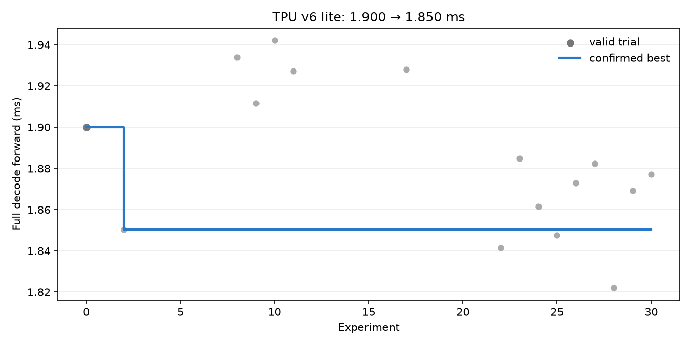

# LLM decode autoresearch — TPU v6 lite

2026-09-27 · Colab CLI 0.7.4 · 30개 후보 · 별도 프로세스 확인 실행 · bf16

시작 후보 **1.9000 ms → 최고 확인 후보 1.8504 ms**: 2.6% 단축, 1.03배.
최고 방법: `fused-qkv-projection` · 실험 브랜치 커밋 `82c9b67`.
첫 측정 1.8504 ms, 확인 측정 1.8435 ms 중 느린 값을 최고 기록으로 사용했다.

## 측정 범위

- `colab` preset: B=8, T=1, S=2048, D=2048, F=5632, 8층, 16 query/KV heads, vocabulary 32000.
- 무작위 가중치의 전체 decode forward이며 모든 logits와 KV cache를 계산한다. 고정 context 마지막 슬롯 갱신이고 연속 생성 서비스 측정은 아니다.
- CPU dispatch와 완료 대기를 포함한 동기화 wall-clock 시간이다. 입력 준비와 컴파일은 제외하고 5회 warmup 뒤 10회씩 7라운드 중앙값을 사용한다.
- `atol=rtol=0.02`, 전체 logits·모든 KV cache·정확한 cache prefix 보존·새 가중치/토큰 재검사를 적용했다. 허용 오차는 실험 중 변경하지 않았다.
- 기기별 초기 구현이 다르므로 아래 수치는 각 기기의 시작 후보 대비 개선이다. 서로 다른 장치의 우열을 판정하는 비교가 아니다.
- 패키지: `{"jax": "0.7.2", "jaxlib": "0.7.2", "libtpu": "0.0.21.1"}`.

## 최종 재검증

| 단계 | 상태 | candidate ms | 같은 실행의 reference ms |
|---|---|---:|---:|
| prefill | ok | 9.2301 | 6.9804 |
| decode | ok | 1.8529 | 1.9438 |

이 최종 실행은 선택된 모델을 새 프로세스에서 다시 검사한 값이며, 위의 두 번 확인된 선택 기록과 별도로 보관한다.

## 모든 시도

상태별 개수: `{"incorrect": 15, "keep": 1, "discard": 14}`. 정확도 실패에는 유효한 성능 점수를 부여하지 않았다.

| # | 방법 | 상태 | 첫 측정 ms | 확인 ms |
|---:|---|---|---:|---:|
| 1 | xla-sdpa | incorrect | — | — |
| 2 | fused-qkv-projection | keep | 1.8504 | 1.8435 |
| 3 | fused-gate-up-projection | incorrect | — | — |
| 4 | matmul-fp32-output | incorrect | — | — |
| 5 | layer-scan-unroll-1 | incorrect | — | — |
| 6 | layer-scan-unroll-2 | incorrect | — | — |
| 7 | layer-scan-unroll-4 | incorrect | — | — |
| 8 | layer-scan-unroll-8 | discard | 1.9339 | — |
| 9 | dot-precision-high | discard | 1.9116 | — |
| 10 | dot-precision-highest | discard | 1.9422 | — |
| 11 | dot-einsum | discard | 1.9272 | — |
| 12 | layernorm-second-moment | incorrect | — | — |
| 13 | decode-only-sdpa | incorrect | — | — |
| 14 | decode-only-layer-scan-unroll-1 | incorrect | — | — |
| 15 | decode-only-layer-scan-unroll-2 | incorrect | — | — |
| 16 | decode-only-layer-scan-unroll-4 | incorrect | — | — |
| 17 | decode-only-layer-scan-unroll-8 | discard | 1.9280 | — |
| 18 | decode-only-gate-up | incorrect | — | — |
| 19 | decode-only-qkv-gate-up | incorrect | — | — |
| 20 | qkv-layernorm-second-moment | incorrect | — | — |
| 21 | qkv-dot-precision-high | incorrect | — | — |
| 22 | qkv-dot-einsum | discard | 1.8415 | — |
| 23 | qkv-flat-head-attention | discard | 1.8849 | — |
| 24 | qkv-flat-head-qk | discard | 1.8614 | — |
| 25 | qkv-flat-head-pv | discard | 1.8476 | — |
| 26 | qkv-flat-token-projection | discard | 1.8729 | — |
| 27 | qkv-flat-token-norm | discard | 1.8823 | — |
| 28 | qkv-explicit-swiglu-rounding | discard | 1.8221 | 1.8714 |
| 29 | qkv-einsum-attention | discard | 1.8691 | — |
| 30 | qkv-decode-only-projection | discard | 1.8770 | — |

## 가설과 결과

### #1 · xla-sdpa (incorrect)
- 가설: Expose attention as the JAX attention primitive so XLA can optimize score/softmax/value execution; preserve already-scaled Q.
- 관찰: output/0: max_abs_err=0.050293. 정확도/실행 조건을 통과하지 못해 채택하지 않았다.

### #2 · fused-qkv-projection (keep)
- 가설: A wider projection may improve MXU utilization at batch 8; measure whether runtime weight concatenation outweighs it.
- 관찰: 직전 최고 1.9000 ms보다 첫 실행과 확인 실행 모두 1% 넘게 빨랐다.

### #3 · fused-gate-up-projection (incorrect)
- 가설: Combine the parallel gate/up matmuls into one wider MXU operation while keeping SwiGLU bf16 semantics.
- 관찰: output/0: max_abs_err=0.0224609. 정확도/실행 조건을 통과하지 못해 채택하지 않았다.

### #4 · matmul-fp32-output (incorrect)
- 가설: Explicit fp32 dot accumulation/output then bf16 rounding may change XLA scheduling without reducing input precision.
- 관찰: output/0: max_abs_err=0.0332031. 정확도/실행 조건을 통과하지 못해 채택하지 않았다.

### #5 · layer-scan-unroll-1 (incorrect)
- 가설: Replace the fully unrolled layer graph with a structured loop; compare code size/scheduling against runtime stacking and cache-copy costs.
- 관찰: output/0: max_abs_err=0.0239258. 정확도/실행 조건을 통과하지 못해 채택하지 않았다.

### #6 · layer-scan-unroll-2 (incorrect)
- 가설: Replace the fully unrolled layer graph with a structured loop; compare code size/scheduling against runtime stacking and cache-copy costs.
- 관찰: output/0: max_abs_err=0.046875. 정확도/실행 조건을 통과하지 못해 채택하지 않았다.

### #7 · layer-scan-unroll-4 (incorrect)
- 가설: Replace the fully unrolled layer graph with a structured loop; compare code size/scheduling against runtime stacking and cache-copy costs.
- 관찰: output/0: max_abs_err=0.046875. 정확도/실행 조건을 통과하지 못해 채택하지 않았다.

### #8 · layer-scan-unroll-8 (discard)
- 가설: Replace the fully unrolled layer graph with a structured loop; compare code size/scheduling against runtime stacking and cache-copy costs.
- 관찰: 현재 최고보다 1% 넘게 빠른 결과를 두 번 확보하지 못했다. 단독 후보의 정확도 통과는 다른 최적화와의 결합을 보장하지 않는다.

### #9 · dot-precision-high (discard)
- 가설: Test explicit dot accumulation precision as an XLA lowering choice without reducing bf16 input precision.
- 관찰: 현재 최고보다 1% 넘게 빠른 결과를 두 번 확보하지 못했다. 단독 후보의 정확도 통과는 다른 최적화와의 결합을 보장하지 않는다.

### #10 · dot-precision-highest (discard)
- 가설: Test explicit dot accumulation precision as an XLA lowering choice without reducing bf16 input precision.
- 관찰: 현재 최고보다 1% 넘게 빠른 결과를 두 번 확보하지 못했다. 단독 후보의 정확도 통과는 다른 최적화와의 결합을 보장하지 않는다.

### #11 · dot-einsum (discard)
- 가설: Express projections as einsum to test whether XLA selects a better batch-8 contraction layout.
- 관찰: 현재 최고보다 1% 넘게 빠른 결과를 두 번 확보하지 못했다. 단독 후보의 정확도 통과는 다른 최적화와의 결합을 보장하지 않는다.

### #12 · layernorm-second-moment (incorrect)
- 가설: Compute LayerNorm variance using E[x²]-E[x]² to reduce reduction dependencies, retaining fp32 statistics and correctness gates.
- 관찰: output/0: max_abs_err=0.0546875. 정확도/실행 조건을 통과하지 못해 채택하지 않았다.

### #13 · decode-only-sdpa (incorrect)
- 가설: Earlier SDPA failed the prefill gate; keep prefill reference semantics and test whether the decode specialization stays within tolerance.
- 관찰: output/0: max_abs_err=0.050293. 정확도/실행 조건을 통과하지 못해 채택하지 않았다.

### #14 · decode-only-layer-scan-unroll-1 (incorrect)
- 가설: Structured loops failed with the prompt shape; test a decode-only loop while leaving prefill untouched.
- 관찰: output/0: max_abs_err=0.046875. 정확도/실행 조건을 통과하지 못해 채택하지 않았다.

### #15 · decode-only-layer-scan-unroll-2 (incorrect)
- 가설: Structured loops failed with the prompt shape; test a decode-only loop while leaving prefill untouched.
- 관찰: output/0: max_abs_err=0.046875. 정확도/실행 조건을 통과하지 못해 채택하지 않았다.

### #16 · decode-only-layer-scan-unroll-4 (incorrect)
- 가설: Structured loops failed with the prompt shape; test a decode-only loop while leaving prefill untouched.
- 관찰: output/0: max_abs_err=0.046875. 정확도/실행 조건을 통과하지 못해 채택하지 않았다.

### #17 · decode-only-layer-scan-unroll-8 (discard)
- 가설: Structured loops failed with the prompt shape; test a decode-only loop while leaving prefill untouched.
- 관찰: 현재 최고보다 1% 넘게 빠른 결과를 두 번 확보하지 못했다. 단독 후보의 정확도 통과는 다른 최적화와의 결합을 보장하지 않는다.

### #18 · decode-only-gate-up (incorrect)
- 가설: Test a decode-only wider MLP projection, retaining the original prefill to isolate the numerical failure.
- 관찰: output/0: max_abs_err=0.0507812. 정확도/실행 조건을 통과하지 못해 채택하지 않았다.

### #19 · decode-only-qkv-gate-up (incorrect)
- 가설: Combine the confirmed QKV benefit with a decode-only wide gate/up projection.
- 관찰: output/0: max_abs_err=0.0507812. 정확도/실행 조건을 통과하지 못해 채택하지 않았다.

### #20 · qkv-layernorm-second-moment (incorrect)
- 가설: Combine the confirmed QKV layout with this independent lowering/reduction choice; retain only a confirmed overall gain.
- 관찰: output/0: max_abs_err=0.0546875. 정확도/실행 조건을 통과하지 못해 채택하지 않았다.

### #21 · qkv-dot-precision-high (incorrect)
- 가설: Combine the confirmed QKV layout with this independent lowering/reduction choice; retain only a confirmed overall gain.
- 관찰: output/0: max_abs_err=0.0351562. 정확도/실행 조건을 통과하지 못해 채택하지 않았다.

### #22 · qkv-dot-einsum (discard)
- 가설: Combine the confirmed QKV layout with this independent lowering/reduction choice; retain only a confirmed overall gain.
- 관찰: 현재 최고보다 1% 넘게 빠른 결과를 두 번 확보하지 못했다. 단독 후보의 정확도 통과는 다른 최적화와의 결합을 보장하지 않는다.

### #23 · qkv-flat-head-attention (discard)
- 가설: Flatten batch and heads to expose larger batched attention contractions to the MXU scheduler.
- 관찰: 현재 최고보다 1% 넘게 빠른 결과를 두 번 확보하지 못했다. 단독 후보의 정확도 통과는 다른 최적화와의 결합을 보장하지 않는다.

### #24 · qkv-flat-head-qk (discard)
- 가설: Isolate the score contraction layout from the value contraction layout.
- 관찰: 현재 최고보다 1% 넘게 빠른 결과를 두 번 확보하지 못했다. 단독 후보의 정확도 통과는 다른 최적화와의 결합을 보장하지 않는다.

### #25 · qkv-flat-head-pv (discard)
- 가설: Isolate the value contraction layout to identify which attention contraction benefits.
- 관찰: 현재 최고보다 1% 넘게 빠른 결과를 두 번 확보하지 못했다. 단독 후보의 정확도 통과는 다른 최적화와의 결합을 보장하지 않는다.

### #26 · qkv-flat-token-projection (discard)
- 가설: Flatten B*T before all projections to expose explicit 2D GEMMs for batch-8 decode.
- 관찰: 현재 최고보다 1% 넘게 빠른 결과를 두 번 확보하지 못했다. 단독 후보의 정확도 통과는 다른 최적화와의 결합을 보장하지 않는다.

### #27 · qkv-flat-token-norm (discard)
- 가설: Flatten token dimensions around LayerNorm to test reduction layout without changing its arithmetic.
- 관찰: 현재 최고보다 1% 넘게 빠른 결과를 두 번 확보하지 못했다. 단독 후보의 정확도 통과는 다른 최적화와의 결합을 보장하지 않는다.

### #28 · qkv-explicit-swiglu-rounding (discard)
- 가설: Make the BF16 sigmoid/multiply boundaries explicit to explore fusion that preserves the reference precision contract.
- 관찰: 현재 최고보다 1% 넘게 빠른 결과를 두 번 확보하지 못했다. 단독 후보의 정확도 통과는 다른 최적화와의 결합을 보장하지 않는다.

### #29 · qkv-einsum-attention (discard)
- 가설: Express the ordinary multi-head score and value products as einsum, keeping GQA on the reference path.
- 관찰: 현재 최고보다 1% 넘게 빠른 결과를 두 번 확보하지 못했다. 단독 후보의 정확도 통과는 다른 최적화와의 결합을 보장하지 않는다.

### #30 · qkv-decode-only-projection (discard)
- 가설: Limit the confirmed packed-QKV projection to decode, keeping prefill exactly on the original path.
- 관찰: 현재 최고보다 1% 넘게 빠른 결과를 두 번 확보하지 못했다. 단독 후보의 정확도 통과는 다른 최적화와의 결합을 보장하지 않는다.

## 재현 자료

- [최고 모델 소스](best_model.py), [전체 평가 JSON](evaluations.json), [실험 TSV](results.tsv), [소스 해시](source-manifest.json).
- 원본 stdout/traceback, 모든 후보 소스와 git bundle은 로컬 `autoresearch/llm_tpu/runs/20260927-parallel/export/`에 보관했다.
- 원래 baseline `model.py`는 바꾸지 않았다. 최고 모델은 별도 결과 스냅샷으로 저장했다.
- 재실행하려면 별도 작업 브랜치에서 이 `best_model.py`를 해당 track의 `model.py`로 복사하고 `python bench.py --phase decode`를 실행한다. 대상 장치와 동일한 패키지 버전을 사용한다.
- 환경·런타임이 바뀌면 다시 측정해야 한다. 장기간 서비스, 다른 batch/context, 학습된 모델 품질에 대한 검증은 포함하지 않는다.

- 이 모델은 decode 기준으로 선택했다. 최종 prefill은 9.230 ms로 같은 실행의 기준 구현 6.980 ms보다 약 32.2% 느렸다. prefill까지 개선된 모델로 해석하면 안 된다.
