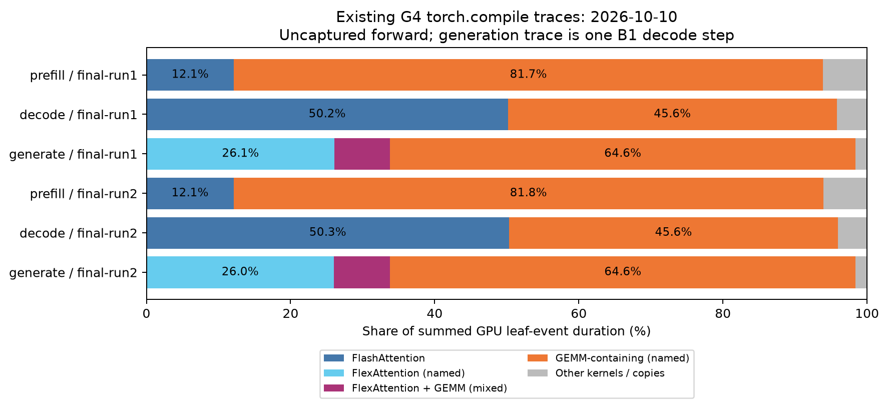

# 기존 G4 결과: B1 prefill과 decode의 분리 분석

주 실행 조건은 **B=1 단독 사용자 추론**이며, **prefill과 decode를 독립적인 workload로 분석한다.** 두 단계는 같은 가중치를 사용하지만 한 번에 처리하는 토큰 수, 가중치 재사용, attention 형태, 최적화 목표가 다르다.

| 단계 | 이번 B1 입력 | 관측된 큰 비용 | 우선 병목 가설 | 최종 평가 지표 |
| --- | --- | --- | --- | --- |
| Prefill | prompt 2048개를 함께 처리, 선형층 M=2048 | GEMM 포함 그룹 약 81.8% | 큰 행렬곱의 연산 장치 활용과 타일링·융합 | prefill 시간, prompt 처리량, TTFT |
| Decode | 새 토큰 1개씩 처리, 선형층 M=1 | GEMM 포함 그룹 약 64.6%, FlexAttention 이름 그룹 약 26.0%, 혼합 그룹 약 7.8% | 가중치·KV 읽기와 중간 메모리 이동 | decode ms/token, 전체 생성 시간 |

두 비중의 분모는 각각 해당 단계 trace의 GPU 작업 시간 합계다. **prefill의 compute 병목과 decode의 memory 병목은 우선 조사할 가설**이며, 실측 연산 장치 활용률이나 메모리 대역폭 포화를 확인한 결론은 아니다. 짧은 prompt·작은 모델에서는 이 가설이 달라질 수 있다.

기존 고정 B8 decode 결과는 보조 자료다. 그 조건에서는 FlashAttention split-KV 본체가 약 48%, combine 포함 약 50%를 차지하지만, 주 실행 조건의 최적화 우선순위를 B8 비중으로 정하지 않는다.

새 GPU 실행 없이 저장소의 결과 JSON과 Chrome trace를 재집계했다. 분석의 주 자료는 2026-10-10 G4 두 실행이고, 2026-10-04 두 실행은 관측이 반복되는지 확인하는 보조 자료다.

## 1. 자료와 비교 조건

| 항목 | 값 |
| --- | --- |
| 실제 측정 GPU | NVIDIA RTX PRO 6000 Blackwell Server Edition, 94.97 GiB, SM120, 188 SM |
| 소프트웨어 | PyTorch 2.11.0+cu130, Triton 3.6.0, CUDA 13.0 |
| 모델 | 8층 decoder, D=2048, FFN=5632, 16 query/KV heads, head_dim=128, vocab=32000 |
| 가중치 수 | 542,183,424 |
| 자료형 | 가중치·activation 저장·KV·logits BF16, 일부 내부 계산과 누산 FP32 |
| 컴파일 | `fullgraph=True`, `dynamic=False`, `max-autotune-no-cudagraphs`; 별도의 외부 CUDA Graph 사용 |
| Prefill | B=1, T=S=2048, 모든 prompt 위치의 logits |
| 고정 decode | B=8, T=1, S=2048; 모든 KV 슬롯이 유효한 SDPA 경로 |
| 연속 생성 | B=1, prompt 2048, 128토큰; prefill 뒤 127회 decode, FlexAttention 경로 |
| 최신 두 실행 | seed 123 / 321, 두 번째 실행은 backend 순서를 반대로 함 |

원본: [10월 10일 run1](../../results/2026-10-10-g4-cuda/final-run1.json), [run2](../../results/2026-10-10-g4-cuda/final-run2.json), [10월 4일 run1](../../results/2026-10-04-g4/final-run1.json), [run2](../../results/2026-10-04-g4/final-run2.json).

최신 결과에 저장된 `bench.py`, `torch_backend.py`, `llm_roofline/spec.py`의 SHA-256은 현재 파일과 두 실행 모두 일치한다. 10월 4일의 `bench.py`와 `torch_backend.py`는 현재 파일과 다르다. 또한 과거 hybrid는 custom attention·M=1 GEMM을 사용했고 최신 hybrid는 작은 연산만 교체했다. 따라서 날짜가 다른 hybrid 수치를 동일 구현의 반복 측정으로 합치지 않았다. 상세 실행 인자와 원본 16개 파일의 SHA-256은 [analysis.json](analysis.json)에 보존했다.

## 2. 성능 측정과 trace의 범위

[기존 측정 코드](../../bench.py)의 고정 workload는 워밍업 후 CUDA Graph를 반복 실행해 시간을 측정한다. 반면 프로파일러는 **Graph로 감싸지 않은 컴파일 함수의 한 번 실행**을 기록한다. 프로파일러가 기록한 커널 비중을 CUDA Graph 전체 시간으로 나누지 않았다.

특히 `*-generate-trace.json`은 **128토큰 전체 생성 trace가 아니다.** 생성 위치를 prompt 끝으로 되돌린 뒤, 한 번의 B=1 decode와 argmax·토큰 복사·위치 갱신을 기록한다. 이후 126개 decode 위치의 커널 시간은 이 자료에 없다.

| 자료 | 담긴 실행 | 시간 해석 |
| --- | --- | --- |
| `timing.device_round_average` | Graph로 고정 forward 100회씩, 5개 round | round 평균들의 중앙값; 개별 요청 p95가 아님 |
| `timing.synchronized_wall` | Graph 호출마다 완료를 동기화 | 개별 호출 wall 시간 |
| 생성 `timing.device_ms` | prefill·cache 복사·토큰 선택·127 decode, 20회 반복 | 128토큰 생성 전체의 중앙값 |
| 생성 `timing.decode_device_ms` | 127 decode 구간 / 127 | 생성 실행별 토큰당 평균의 중앙값 |
| prefill/decode trace | Graph 없는 forward 한 번 | 커널별 진단값; 반복 지연 분포가 아님 |
| generate trace | Graph 없는 첫 위치의 B=1 decode 한 번 | 첫 decode 위치의 진단값 |

Chrome trace에서 `ph='X'`이고 `cat`이 `kernel`, `gpu_memcpy`, `gpu_memset`인 leaf event만 집계했다. compiled-region annotation과 자식 커널을 중복 계산하지 않았다. `displayTimeUnit='ms'`는 화면 표시 단위이고, Chrome trace의 `ts`·`dur`는 µs로 계산했다.

**커널 비중의 분모는 해당 trace의 leaf-event duration 합계**다. 모든 분석 trace에서 이벤트는 단일 GPU·단일 stream에 있고, GPU leaf interval의 유의미한 겹침은 없었다. raw trace를 재집계한 호출 수와 시간은 원본 결과 JSON의 `profile.cuda_kernels`와 12개 trace 모두 일치했다.

## 3. 최신 PyTorch 기준선

각 실행의 중앙값을 따로 기록했다. 서로 다른 실행의 표본을 합치지 않았다.

| 구간 | run1 GPU ms | run2 GPU ms | run1 wall ms | run2 wall ms |
| --- | ---: | ---: | ---: | ---: |
| Prefill, CUDA Graph | 6.856 | 6.870 | 6.865 | 6.908 |
| 고정 B8 decode, CUDA Graph | 1.545 | 1.543 | 1.579 | 1.577 |
| 128토큰 전체 생성 | 158.336 | 158.388 | 158.351 | 158.402 |
| 생성 TTFT, GPU | 7.161 | 7.180 | — | — |
| 생성 B1 decode, GPU ms/token | 1.190 | 1.191 | — | — |

전체 logits와 모든 유효 KV에 대한 기존 수치 검증은 합격했다. 고정 decode에는 바뀐 입력으로 Graph를 실행하는 검사도 포함되어 있고, 생성에는 reference 토큰을 공급하는 누적 KV 검사와 Graph replay 검사가 포함되어 있다. 이 보고서는 기존 검증 결과를 확인한 것이며 새 GPU 정확성 검사를 수행하지 않았다.

## 4. B1 prefill 분석

### 실행 조건과 기준 성능

prefill은 B=1이지만 **2048개 prompt 토큰을 한 번에 계산**한다. 따라서 선형층의 행렬곱은 `[2048,K] @ [K,N]`이며, 같은 가중치를 여러 토큰에 재사용한다. B1 decode의 `[1,K] @ [K,N]`와 연산 집약도를 같은 것으로 취급하지 않는다.

| 지표 | run1 | run2 |
| --- | ---: | ---: |
| Prefill CUDA Graph GPU 시간 | 6.856 ms | 6.870 ms |
| Prefill 동기화 wall 시간 | 6.865 ms | 6.908 ms |
| prompt 처리량, 2048 / GPU 시간 | 약 298.7k token/s | 약 298.1k token/s |
| Graph 없는 진단 trace의 GPU 작업 시간 합계 | 6,820.082 µs | 6,837.625 µs |
| 진단 trace의 커널 event 수 | 90 | 90 |

TTFT는 생성 workload에서 측정한 **7.161 / 7.180 ms**다. cache 복사와 첫 argmax 등이 포함되므로 prefill 단독 시간과 구분한다. 현재 prefill은 **모든 prompt 위치의 logits**를 계산한다. 마지막 위치에만 LM head를 적용하는 변경은 출력 계약이 달라지는 별도 실험이며 이번 기준선에 섞지 않는다.

### 상위 커널과 실제 행렬곱 shape

| 커널 이름 또는 식별자 | 호출 수 | run1 합계 µs | run1 비중 | run2 합계 µs | run2 비중 |
| --- | ---: | ---: | ---: | ---: | ---: |
| `cutlass_80_tensorop_bf16_s16816gemm_relu_bf16_256x128_32x3_nn_align8` | 9 | 2,619.765 | 38.41% | 2,632.878 | 38.51% |
| `triton_tem_fused__to_copy__unsafe_view_mm_mul_silu_split_view_7` | 8 | 1,212.264 | 17.77% | 1,217.829 | 17.81% |
| `triton_tem_fused__unsafe_view_add_embedding_mm_native_layer_norm_view_9` | 7 | 1,113.164 | 16.32% | 1,117.763 | 16.35% |
| `pytorch_flash::flash_fwd_kernel` | 8 | 828.038 | 12.14% | 827.683 | 12.10% |
| `triton_tem_fused__unsafe_view_clone_mm_transpose_view_4` | 8 | 462.242 | 6.78% | 461.859 | 6.75% |
| `cutlass_80_tensorop_bf16_s16816gemm_relu_bf16_128x128_32x4_nn_align8` | 1 | 166.818 | 2.45% | 164.001 | 2.40% |

CUTLASS와 FlashAttention의 긴 템플릿 이름은 줄였다. 가장 큰 CUTLASS 이름에 해당하는 **GPU event 9개 모두를 `External id`로 CPU의 `aten::mm`에 연결**하면 다음 두 shape로 나뉜다.

| 실제 행렬 shape | 모델 내 대응 | 호출 수 | run1 GPU 합계 µs | run2 GPU 합계 µs |
| --- | --- | ---: | ---: | ---: |
| `[2048,2048] @ [2048,11264]` | packed gate/up projection | 8 | 1,956.208 | 1,966.411 |
| `[2048,2048] @ [2048,32000]` | 모든 prompt 위치의 LM head | 1 | 663.557 | 666.467 |

같은 커널 이름이 서로 다른 shape에 사용된다는 점을 시간표에 반영했다. 연결한 호출 수·시간·input dims/stride는 [analysis.json](analysis.json)의 `correlated_cpu_shapes`에 저장했다. 커널 이름의 `relu`라는 문자열만으로 이 모델의 활성화 함수를 판단하지 않는다.

### 연산과 데이터 이동 모델

BF16 단독 GEMM에서 입력과 가중치를 한 번 읽고 출력을 한 번 저장하는 단순 모델은 다음과 같다.

\[
F=2MKN,\quad Q=2(MK+KN+MN)\ \text{byte},\quad AI=F/Q
\]

| Prefill의 선형 연산 | M,K,N | FLOP | byte | AI, FLOP/byte |
| --- | --- | ---: | ---: | ---: |
| QKV | 2048,2048,6144 | 51,539,607,552 | 58,720,256 | 877.7 |
| gate/up | 2048,2048,11264 | 94,489,280,512 | 100,663,296 | 938.7 |
| down | 2048,5632,2048 | 47,244,640,256 | 54,525,952 | 866.5 |
| LM head | 2048,2048,32000 | 268,435,456,000 | 270,532,608 | 992.2 |

모두 논리적인 입출력 모델로 계산한 값이다. 구현의 중복 읽기, cache, workspace, 융합으로 생략하는 출력, 다른 연산은 포함하지 않는다. 높은 AI는 **연산 장치 활용을 우선 조사할 근거**이며, compute-bound가 실측으로 확인되었다는 의미는 아니다.

prefill attention은 많은 query를 처리하는 causal attention이며, decode의 짧은 query용 split-KV와 다른 `flash_fwd_kernel`이 기록되어 있다. query 타일에서 KV를 재사용하고 score/probability 행렬의 메모리 저장을 줄이는 것이 중요하다. 현재 구현도 이미 FlashAttention 경로를 사용한다.

### Prefill의 첫 최적화 실험

1. **B1/T2048·BF16·모든 prompt 위치의 logits·같은 causal attention**을 고정한다. prefill 시간과 prompt 처리량으로 평가하고, TTFT도 별도로 확인한다.
2. 상위 CUTLASS의 **gate/up GEMM과 LM head**를 실제 shape·stride로 분리 측정하고, 라이브러리/Inductor의 현재 선택과 타일 후보를 비교한다. 컴파일·autotune·warmup을 시간에서 제외하고 Graph 사용 조건을 맞춘다.
3. Tensor Core 활용률, DRAM/L2 처리량, spill과 stall을 측정해 높은 AI에서도 실행 시간이 늘어나는 원인을 확인한다. 큰 타일의 재사용 이점과 레지스터·공유 메모리 소비 사이의 균형을 본다.
4. gate/up GEMM과 SwiGLU 융합을 독립 후보로 비교한다. 기존 코드의 융합 가능성을 고려해 생성 코드의 경계와 BF16 반올림을 확인하고, 현재 구현과 명확히 다른 후보를 평가한다.
5. attention·GEMM·융합은 각각 변경한다. prefill 출력의 full logits와 모든 KV를 검증한 뒤 prefill 전체를 다시 측정한다.

## 5. B1 decode 분석

실제 연속 생성의 decode GPU 시간은 **1.190 / 1.191 ms/token**이다. 아래 trace는 그 전체 구간이 아닌 **첫 decode 위치 한 번**이며, leaf 합계는 **1,186.699 / 1,189.582 µs**다. 유효 KV 길이는 2049, 할당 capacity는 2176이다.

| 커널 이름 | 호출 수 | run1 합계 µs | run1 비중 | run2 합계 µs | run2 비중 |
| --- | ---: | ---: | ---: | ---: | ---: |
| `triton_tem_fused__to_copy_flex_attention_ones_slice_sort_sum_transpose_zeros_7` | 8 | 288.897 | 24.34% | 289.410 | 24.33% |
| `triton_red_fused__unsafe_view_add_embedding_mm_native_layer_norm_view_13` | 8 | 268.546 | 22.63% | 268.578 | 22.58% |
| `triton_red_fused__to_copy__unsafe_view_mm_mul_silu_split_view_15` | 8 | 166.399 | 14.02% | 165.729 | 13.93% |
| `triton_red_fused_embedding_mm_native_layer_norm_view_1` | 8 | 162.145 | 13.66% | 163.234 | 13.72% |
| `triton_red_fused__unsafe_view_add_mm_native_layer_norm_view_25` | 1 | 87.361 | 7.36% | 87.489 | 7.35% |
| `triton_red_fused__to_copy_flex_attention_mm_ones_slice_sort_sum_transpose_view_zeros_10` | 8 | 81.506 | 6.87% | 82.881 | 6.97% |

가장 큰 커널 이름 하나는 FlexAttention이지만, **모델 전체에 반복되는 GEMM 포함 경로들을 합치면 더 큰 비용**이 된다. 따라서 weight 읽기와 M=1 선형층 구현을 먼저 조사하고, KV 읽기와 attention을 함께 분석한다. 이름에 normalization·activation 등이 포함되어 있으므로 위 수치를 해당 연산 하나의 시간으로 확정하지 않는다.

### B1에서의 논리적 메모리 이동 모델

한 토큰의 선형층은 대체로 `[1,K] @ [K,N]`이다. 가중치 읽기가 주된 데이터 이동이고 BF16 가중치를 한 번씩 읽는 단순 모델에서는:

\[
AI\approx\frac{2KN\ \text{FLOP}}{2KN\ \text{byte}}=1\ \text{FLOP/byte}
\]

큰 M 타일로 여러 토큰에 가중치를 재사용하는 방법은 M=1 조건에서 제한된다. 남은 목표는 같은 토큰을 계산할 때 중복 읽기·중간 텐서를 줄이고, 연속 접근과 적절한 분할을 통해 필요한 데이터를 효율적으로 공급하는 것이다.

실제 모델 shape로 계산한 선형층 가중치 수는 다음과 같다. `D=2048`, `F=5632`, `V=32000`, `L=8`이며 이 모델은 query와 KV head 수가 같아 Q/K/V projection 폭도 각각 D다.

\[
N_W=L(4D^2+3DF)+DV=476{,}577{,}792
\]

| 한 decode 단계의 데이터 | 논리적 byte 수 | 계산 조건 |
| --- | ---: | --- |
| 모든 projection·FFN·LM head 가중치 | 953,155,584 byte, 약 0.953 GB | BF16, 각 가중치를 한 번 읽음; embedding 전체와 LayerNorm 파라미터 제외 |
| 첫 위치의 8층 KV | 134,283,264 byte, 약 0.134 GB | B1, 16 heads, head_dim 128, 유효 길이 2049; K/V 각 한 번 읽음 |
| 두 항목 합계 | 1,087,438,848 byte, 약 1.087 GB | activation·부분 결과·중복 읽기·cache 효과 제외 |

이 모델과 context에서는 가중치 읽기의 논리적 byte 수가 KV보다 약 7.1배 크다. **실측 DRAM byte 수나 실행 시간 비율이 7.1배라는 뜻은 아니다.** 융합 경계, cache와 접근 효율에 따라 달라지고, context가 길어지면 KV 비중도 증가한다. 이 계산만으로 현재 GPU가 대역폭 한계에 도달했다고 주장하지 않는다.

## 6. 보조 조건: 고정 B8 decode의 상위 커널

run1 GPU leaf 시간 합계는 **1,520.116 µs**, run2는 **1,517.290 µs**다. 각각 90개 kernel event, 19개 커널 이름이 기록되어 있다.

| 커널 이름 또는 식별자 | 호출 수 | run1 합계 µs | run1 비중 | run2 합계 µs | run2 비중 |
| --- | ---: | ---: | ---: | ---: | ---: |
| `pytorch_flash::flash_fwd_splitkv_kernel` | 8 | 731.944 | 48.15% | 733.640 | 48.35% |
| `triton_tem_fused__unsafe_view_add_embedding_mm_native_layer_norm_view_6` | 8 | 263.076 | 17.31% | 262.881 | 17.33% |
| `triton_tem_fused_embedding_mm_native_layer_norm_view_1` | 8 | 146.816 | 9.66% | 145.731 | 9.60% |
| `triton_tem_fused__to_copy__unsafe_view_mm_mul_silu_split_view_8` | 8 | 137.189 | 9.02% | 137.633 | 9.07% |
| `triton_tem_fused__unsafe_view_add_mm_native_layer_norm_view_16` | 1 | 87.681 | 5.77% | 87.745 | 5.78% |
| `triton_tem_fused_mm_transpose_view_4` | 8 | 58.720 | 3.86% | 58.303 | 3.84% |
| `pytorch_flash::flash_fwd_splitkv_combine_kernel` | 8 | 30.720 | 2.02% | 30.049 | 1.98% |
| 나머지 커널 | 41 | 63.970 | 4.21% | 61.308 | 4.04% |

긴 FlashAttention 템플릿 이름은 줄였다. 정확한 전체 이름과 모든 항목은 [kernels.csv](kernels.csv)에 있다.

split-KV 본체의 호출당 평균은 **91.493 / 91.705 µs**, combine은 **3.840 / 3.756 µs**다. 두 실행 모두 8개 층에서 이 경로가 반복된다. 일부 Triton 커널 이름에는 `mm`뿐 아니라 normalization·residual·activation이 함께 포함되어 있으므로, 위 시간을 순수 행렬곱 시간으로 해석하지 않는다.

### 실제 attention 입력과 자원

커널의 `External id`를 CPU의 `aten::_flash_attention_forward` event와 연결해 다음 입력을 확인했다. 아래는 내부 API가 기록한 `[B, sequence, heads, head_dim]` 순서다.

| 입력 | shape | stride, 원소 단위 |
| --- | --- | --- |
| Q | `[8, 1, 16, 128]` | `[2048, 2048, 128, 1]` |
| K | `[8, 2048, 16, 128]` | `[4194304, 128, 262144, 1]` |
| V | `[8, 2048, 16, 128]` | `[4194304, 128, 262144, 1]` |

대표 split-KV event의 grid는 `[1, 8, 128]`, block은 `[128, 1, 1]`, 레지스터는 thread당 200개, 공유 메모리는 block당 81,920 byte다. grid만으로 backend의 split 파라미터를 임의로 역산하지 않았다.

trace의 `est. achieved occupancy %`에는 이 커널에서도 0이 기록되어 있다. **이를 실제 occupancy가 0이라는 측정값으로 사용하지 않는다.** 레지스터·공유 메모리 사용량은 다음 실험의 확인 대상이지만, spill이나 자원 제한이 병목이라는 증거는 아직 없다.

## 7. 다른 workload와의 차이



그래프는 **커널 이름에 따른 분류**다. `GEMM-containing`은 이름에 `mm`이 있거나 CUTLASS인 커널이며, 융합된 다른 연산의 시간도 포함한다. `FlexAttention + GEMM`은 이름에 둘 다 포함된 혼합 커널이다. 그룹 내부의 개별 연산 기여도는 분리하지 못한다.

| 최신 trace | attention 이름 그룹 | GEMM 포함 이름 그룹 | 혼합 FlexAttention+GEMM | 기타 |
| --- | ---: | ---: | ---: | ---: |
| Prefill run1 / run2 | 12.14% / 12.10% | 81.73% / 81.82% | — | 6.13% / 6.08% |
| 고정 B8 decode run1 / run2 | 50.17% / 50.33% | 45.62% / 45.63% | — | 4.21% / 4.04% |
| 첫 위치 B1 decode run1 / run2 | 26.10% / 26.02% | 64.59% / 64.58% | 7.71% / 7.80% | 1.60% / 1.60% |

Prefill에서는 GEMM을 포함하는 커널들이 큰 비중을 차지한다. 가장 큰 CUTLASS 커널 이름 하나가 9회 호출되고 합계 **2,619.765 / 2,632.878 µs**, 비중 **38.41% / 38.51%**다. 다른 shape의 GEMM들이 같은 커널 이름을 사용할 수 있으므로 이것을 특정 선형층 하나의 시간으로 단정하지 않는다.

첫 위치의 B1 decode는 140개 kernel event와 DtoD 복사 1개가 기록되었다. 가장 큰 FlexAttention 이름 커널은 **288.897 / 289.410 µs**, 비중 **24.34% / 24.33%**다. 고정 B8 decode와는 attention backend, query batch, cache capacity, mask 정책이 다르다. **B8에서 선정한 최적화 대상을 B1 연속 생성에 그대로 적용할 근거는 없다.**

### 10월 4일 관측과의 대조

| 지표 | 10월 4일 run1 / run2 | 10월 10일 run1 / run2 |
| --- | ---: | ---: |
| PyTorch 고정 decode, Graph ms | 1.545 / 1.545 | 1.545 / 1.543 |
| split-KV 본체, leaf 시간 비중 | 48.23% / 48.15% | 48.15% / 48.35% |
| split-KV+combine, leaf 시간 비중 | 50.23% / 50.15% | 50.17% / 50.33% |
| B1 진단 trace, kernel+copy 수 | 125 / 125 | 141 / 141 |

고정 B8 decode에서 attention이 약 절반이라는 관측은 두 날짜의 네 실행 모두에서 반복된다. B1의 커널 개수는 달라졌으며 실행 인자·컴파일러 선택·코드 버전도 다르므로 원인을 하나로 귀속하지 않는다.

## 8. CUDA Graph와 trace의 빈 구간

| 고정 workload | run1 Graph GPU ms | run1 Graph 없는 GPU ms | run2 Graph GPU ms | run2 Graph 없는 GPU ms |
| --- | ---: | ---: | ---: | ---: |
| Prefill | 6.856 | 7.017 | 6.870 | 7.035 |
| B8 decode | 1.545 | 1.708 | 1.543 | 1.702 |

B8 decode에서 Graph 없는 측정과 Graph 측정의 차이는 **0.163 / 0.159 ms**, Graph 없는 시간의 약 **9.53% / 9.32%**다. 이는 실행 제출 방식에 따른 개선 여지가 실제로 있음을 보여주지만, 그 차이 전체를 Python 또는 커널 launch 비용으로 분해한 측정은 아니다.

| 진단 trace | run1 leaf 합계 µs | run1 첫 GPU event~마지막 종료 µs | run1 비포함 구간 µs | run2 비포함 구간 µs |
| --- | ---: | ---: | ---: | ---: |
| Prefill | 6,820.082 | 7,056.181 | 236.099 | 217.065 |
| 고정 B8 decode | 1,520.116 | 1,827.218 | 307.102 | 305.445 |
| 첫 위치 B1 decode | 1,186.699 | 1,400.202 | 213.503 | 237.180 |

비포함 구간은 GPU leaf event interval의 합집합이 덮지 않은 trace 구간이다. 프로파일러 오버헤드, CPU 제출 지연 등 여러 원인이 가능하며, GPU 전체가 idle이었다는 하드웨어 측정이나 CUDA Graph의 낭비 시간으로 해석하지 않는다.

## 9. 보조 조건 B8의 메모리 병목과 타일링 가설

한 층의 고정 B8 attention에서 K와 V를 각각 한 번 읽는다고 가정하면:

\[
\text{KV byte}=2\times B\times H\times S\times D\times 2
=134{,}217{,}728\ \text{byte}=128\ \text{MiB}
\]

여기서 첫 번째 2는 K와 V, 마지막 2는 BF16 원소의 byte 수다. 8개 층을 합치면 논리적인 KV 읽기량은 **1 GiB**다.

QK와 PV의 주요 곱셈·누산 연산량은:

\[
\text{FLOP}\approx4BHSD=134{,}217{,}728\ \text{FLOP/층}
\]

따라서 이 단순 모델의 연산 집약도는 **약 1 FLOP/byte**다. softmax, Q·출력·부분 결과 접근, 실제 cache hit·중복 읽기는 제외했다. 이 수치는 **알고리즘의 논리적 데이터 이동 모델**이며 실제 HBM traffic이나 달성 대역폭을 측정한 값이 아니다.

query가 하나이므로 큰 query 타일에 여러 query를 묶어 KV를 재사용하는 방법은 이 workload에서 제한된다. B=8의 각 batch도 서로 다른 KV를 사용한다. 가능한 개선 가설은 KV 접근 패턴과 layout, KV 방향 분할의 병렬성, 부분 결과 combine 비용, 레지스터·공유 메모리 사용량의 균형이다. split을 늘리면 병렬성은 늘 수 있지만 중간 결과와 combine 비용도 커질 수 있다.

GEMM은 별도로 봐야 한다. 가중치 읽기가 주된 이동량인 BF16 `M×K @ K×N`의 단순 모델에서는 `AI≈M FLOP/byte`다. B8 decode의 M=8과 B1의 M=1은 데이터 재사용 조건부터 다르며, activation·출력·cache 효과를 반영하면 이 근사도 달라진다.

**현재 가설:** 고정 B8 decode의 주된 attention 비용에는 낮은 연산 집약도의 KV 읽기와 split-KV 실행 구조가 영향을 줄 가능성이 있다. **미측정:** DRAM/L2 처리량, 실측 occupancy, 레지스터 spill, Tensor Core 활용률, stall 원인. 따라서 아직 “메모리 대역폭 포화가 확인되었다”고 결론내리지 않는다.

기존 결과 폴더와 final-run 로그에는 Inductor 생성 코드의 별도 덤프가 없다. 따라서 커널 이름에 나타난 융합의 단서는 확인했지만, 생성 코드 내부의 정확한 타일 크기·연산 융합·각 연산의 시간 기여도까지 확인한 것은 아니다.

## 10. 기존 다른 backend 결과가 주는 단서

최신 실험의 작은 연산 교체 경로는 GEMM과 attention을 PyTorch에 맡긴다.

| 경로 | B1 prefill run1 / run2 ms | B1 decode run1 / run2 ms/token | 128토큰 생성 run1 / run2 ms |
| --- | ---: | ---: | ---: |
| PyTorch compile | 6.856 / 6.870 | 1.190 / 1.191 | 158.336 / 158.388 |
| PyTorch + 작은 Triton 연산 | 6.865 / 6.899 | 1.193 / 1.186 | 158.651 / 157.681 |
| PyTorch + 작은 CUDA 연산 | 7.297 / 7.299 | 1.266 / 1.268 | 168.338 / 168.628 |
| Native Triton | 7.173 / 7.156 | 0.938 / 0.937 | 126.596 / 126.427 |

prefill에서는 PyTorch 기준선이 위 비교 경로들보다 빠르다. B1 decode에서는 Native Triton의 ms/token이 작다. **한 경로가 decode에 유리하다고 prefill에도 유리한 것은 아니다.** 작은 Triton 연산 교체의 B1 decode 차이는 실행별로 방향이 달라 뚜렷한 개선을 주장하지 않는다. 전체 구현 경로가 여러 연산을 함께 바꾸므로 Native Triton의 decode 개선을 custom attention 또는 특정 GEMM 하나의 효과로 귀속할 수는 없다.

## 11. B1 decode의 다음 실험 제안

첫 대상으로 **B1 decode의 GEMM 포함 경로**, 특히 `triton_red_fused__unsafe_view_add_embedding_mm_native_layer_norm_view_13`과 이어지는 상위 GEMM 포함 커널들을 선정한다. attention은 같은 B1 조건의 FlexAttention을 유지한 상태에서 분리 조사한다.

1. **B=1, T=1, BF16, 같은 weights와 cache capacity, 같은 유효 KV 위치와 mask**를 고정한다. 첫 위치뿐 아니라 생성 중간·마지막 위치를 측정해 기존 한 단계 trace의 한계를 보완한다.
2. Inductor 생성 코드를 저장해 상위 `mm` 포함 커널을 실제 projection·FFN·LM head의 shape와 연결한다. 이름만으로 특정 선형층을 추정하지 않는다.
3. hardware profiler로 **선형층의 DRAM/L2 byte 수와 처리량, 중복 읽기, KV 읽기, stall, spill**을 확인한다. 캐시 효과를 통제하며 커널 시간과 GPU 작업 사이 빈 구간을 구분한다.
4. 연산 의미와 BF16 조건을 유지하면서 M=1에 맞는 matvec/작은-M GEMM 분할, weight 접근 layout, residual·normalization·activation 융합을 각각 실험한다. 분할의 부분 결과와 임시 버퍼 비용도 포함한다. 이미 수행되는 융합을 다시 최적화했다고 세지 않는다.
5. attention을 조사할 때도 **B1·현재 mask·KV 위치·layout**을 유지한다. KV 타일과 split 수는 메모리 공급과 병렬성의 균형을 위한 후보이며, combine까지 포함해 비교한다.
6. 전체 모델의 **full logits·모든 유효 KV·cache prefix·Graph replay** 검사를 통과한 뒤 최종 **B1 decode ms/token, 128토큰 생성 시간, TTFT**를 비교한다. 컴파일·워밍업·Graph capture를 정상 실행 시간에서 제외하고 Graph 사용 여부를 맞춘다.

가중치 양자화는 읽는 byte 수를 줄일 수 있지만 자료형과 수치 특성이 달라지는 별도 실험이다. 현재 BF16 커널 최적화 비교에 섞지 않는다. 배치를 늘리는 방법은 사용자의 B1 단독 사용자 조건을 바꾸므로 이번 최적화 목표로 삼지 않는다.

decode 단계의 결론은 다음과 같다.

> B1 단독 사용자 decode에서는 가중치·KV 읽기를 중심으로 분석한다. 첫 위치 trace에서 일반 GEMM 포함 그룹이 약 64.6%이고, 가중치 중심 연산 집약도는 단순 모델에서 약 1 FLOP/byte다. 상위 M=1 GEMM 포함 커널의 실제 메모리 지표를 먼저 확인하고, B1 조건을 유지한 메모리 접근·융합·분할 실험으로 검증한다.

## 12. 단계별 평가와 재집계

최적화의 채택 기준도 분리한다. **prefill 변경은 prefill 시간·prompt 처리량·TTFT**, **decode 변경은 decode ms/token·전체 생성 시간**으로 판단하고, 어느 단계의 변화인지 각각 기록한다. 128토큰 생성 전체 시간 하나로 두 단계의 병목이나 최적화 효과를 판단하지 않는다. 모델에 두 변경을 결합할 때도 각 단계의 성능과 정확성을 다시 확인한다.

저장소 루트에서 GPU 없이 재집계할 수 있다. 원본 JSON과 trace가 `llm_bench/results/`에 있어야 한다. 이 폴더는 저장소의 `.gitignore` 대상이므로 별도 checkout에는 원본 자료를 가져와야 한다.

```bash
python3 llm_bench/profiling/analyze.py

# matplotlib이 설치된 프로젝트 환경에서 그림도 재생성
MPLCONFIGDIR=/tmp/tensor2silicon-mpl \
.venv/bin/python llm_bench/profiling/analyze.py --plot
```

분석 프로그램은 원본 결과를 덮어쓰지 않고 [analysis.json](analysis.json), [kernels.csv](kernels.csv), 선택적으로 [kernel-shares.png](kernel-shares.png)를 생성한다. 완료된 두 날짜의 네 실행, PyTorch의 12개 trace, 264개 커널 이름별 행을 검증·집계했다. 현재 보고서의 수치는 새 측정값이 아니라 위 자료의 재분석 결과다.
