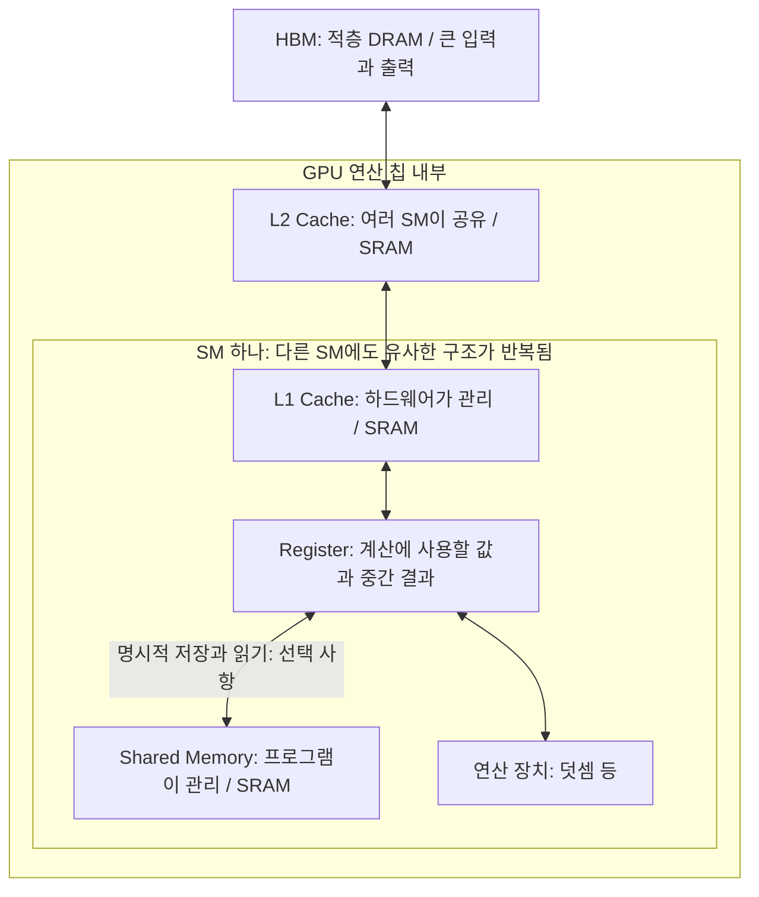

# ③ HBM·DRAM·SRAM: 왜 큰 메모리와 작은 메모리가 함께 필요한가

> **한 줄 답.** 많은 데이터를 담는 메모리와 연산 장치 가까이에서 빠르게 공급하는 저장 공간은 역할이 다르다. GPU는 이들을 계층으로 연결해 사용한다.

이전 ← [② 메모리 용량과 대역폭](./02-capacity-and-bandwidth.md) · [목차](./README.md) · 다음 → [④ 두 가지 시간](./04-compute-and-memory-time.md)

## 1. HBM은 DRAM의 한 종류다

DRAM (Dynamic Random-Access Memory)은 많은 데이터를 비교적 높은 밀도로 저장하는 메모리 기술이다. HBM (High Bandwidth Memory)은 DRAM을 적층하고 넓은 연결을 사용해 높은 대역폭을 제공하는 메모리다. **HBM과 DRAM은 서로 배타적인 두 종류가 아니다.** [Micron의 HBM2E 설명](https://www.micron.com/about/blog/applications/data-center/hbm2e-fastest-memory-modern-data-center)

용어: DRAM은 저장한 값을 유지하기 위한 주기적인 갱신이 필요하다. HBM은 이 DRAM 기술을 사용하는 메모리의 한 종류다.

SRAM (Static Random-Access Memory)은 전원이 공급되는 동안 DRAM과 같은 주기적 갱신 없이 값을 유지한다. 빠른 접근에 적합하지만 같은 용량을 구현하는 데 일반적으로 더 큰 면적이 필요하다. GPU의 캐시와 Shared Memory는 SRAM 기반으로 구현된다.

용어: SRAM의 static은 비휘발성을 뜻하지 않는다. 전원이 꺼져도 데이터가 남는 저장 장치라는 의미가 아니다.

많은 모델 데이터는 HBM에 저장하고, 당장 사용할 일부는 칩 내부의 작은 저장 공간에 둔다. 모든 데이터를 SRAM으로 바꾸면 같은 용량을 위한 면적과 비용 부담이 커진다. 물리적으로 가까이 둔다는 것만으로 무제한의 용량과 전송량을 얻을 수는 없다. DRAM·SRAM의 속도와 집적도 차이는 [Micron 메모리 입문 자료의 비교표](https://www.micron.com/content/dam/micron/educatorhub/intro-to-memory/micron-intro-to-memory-presentation.pdf)에서도 확인할 수 있다.

## 2. 위치와 역할로 계층 읽기

GPU (Graphics Processing Unit)의 연산 장치들은 여러 SM (Streaming Multiprocessor)에 나뉘어 있다. HBM과 L2는 여러 SM이 이용하며, L1·Shared Memory·레지스터 파일은 SM 쪽에 있다.

용어: SM은 스레드를 실행하는 연산 장치와 가까운 저장 공간을 묶은 GPU 내부의 실행 단위다.

| 저장 공간 | 위치·범위 | 역할과 관리 방식 |
|---|---|---|
| HBM | GPU 연산 다이 밖, 같은 패키지의 메모리 스택 | 입력·출력·가중치 등 큰 데이터를 저장한다. 모든 GPU가 HBM을 사용하는 것은 아니다. |
| L2 Cache | GPU 칩 내부, 여러 SM이 공유 | 하드웨어가 데이터 사본을 관리해 메인 메모리 접근을 줄인다. |
| L1 Cache | SM 내부 | 해당 SM에서 접근하는 데이터를 하드웨어가 캐시한다. |
| Shared Memory | SM 내부, 일반적인 사용에서는 스레드 블록이 공유 | 프로그램이 명시적으로 저장·읽기와 필요한 동기화를 관리한다. |
| Register | SM 내부의 레지스터 파일 | 스레드가 계산에 사용하는 값과 중간 결과를 보관한다. |

용어: 캐시(cache)는 다시 사용할 가능성이 있는 데이터의 사본을 보관하는 공간이다. Shared Memory는 프로그래머가 직접 관리하는 작업 공간으로, 자동 캐시와 사용 방식이 다르다.

일부 GPU에서는 L1과 Shared Memory가 같은 물리적 저장 자원을 나누어 사용한다. 그래도 **캐시와 명시적 작업 공간의 역할은 구분**해야 한다. 계층의 위치와 역할은 [Scaling Book 12장의 Memory](https://jax-ml.github.io/scaling-book/gpus/#memory)를 참고한다.

## 3. 데이터가 연산 장치까지 오는 길

다음은 일반적인 전역 메모리 접근과, 프로그램이 선택적으로 사용하는 Shared Memory를 구분한 개념도다. 특정 GPU의 모든 전송 경로나 명령을 나타내지는 않는다.

간단한 예시: Vector Add는 A·B의 값을 읽어 레지스터에서 덧셈하고 결과를 C에 쓴다. 이 연산을 위해 Shared Memory를 반드시 경유할 필요는 없다. 실제 경로에서는 캐시 적중이나 우회 정책에 따라 접근하는 계층이 달라질 수 있다.

이번 손계산에서는 **입력이 HBM에서 한 번씩 오고 결과가 한 번 나간다**고 가정한다. 계층 그림에 화살표가 여러 개 있다고 HBM 이동량을 계층 수만큼 곱하지 않는다. HBM 연결을 기준으로 센 바이트에 HBM 대역폭을 적용한다.

## 4. 작은 저장 공간에 모두 둘 수 없는 이유

공통 예제의 A·B·C는 총 1.2 GB다. 이 전체를 각 SM의 작은 저장 공간에 모두 넣는 대신, 커널은 일부 원소를 읽어 계산하고 결과를 저장하는 작업을 반복할 수 있다.

작은 메모리는 용량이 제한되지만 가까운 곳에서 값을 반복 사용하기에 유리하다. 큰 메모리는 전체 데이터를 담는 역할을 맡는다. 이처럼 서로 다른 장점을 함께 이용하는 것이 계층의 이유다. 데이터를 나누어 재사용하는 구체적인 Tiling 방법은 4주차에 다룬다.

## 5. 선택 읽기: TPU의 HBM과 VMEM

TPU (Tensor Processing Unit)에도 큰 데이터를 보관하는 HBM과 칩 내부의 VMEM (Vector Memory)이 있다. VMEM은 컴파일러가 데이터 이동을 관리하는 작업 공간이다. GPU의 자동 캐시와 동일한 방식으로 이해하지 않는다. 이번에는 HBM과 가까운 작업 공간을 구분하는 데 집중한다. [Scaling Book 2장: What Is a TPU?](https://jax-ml.github.io/scaling-book/tpus/)

## 6. 확인 질문

- “HBM 대신 DRAM을 쓴다”는 표현이 왜 부정확할 수 있는가?
- L1 Cache와 Shared Memory는 무엇이 비슷하고 누가 관리한다는 점에서 다른가?
- Vector Add에서 Shared Memory 사용이 필수인가? HBM 이동량을 어느 경계에서 세었는가?
