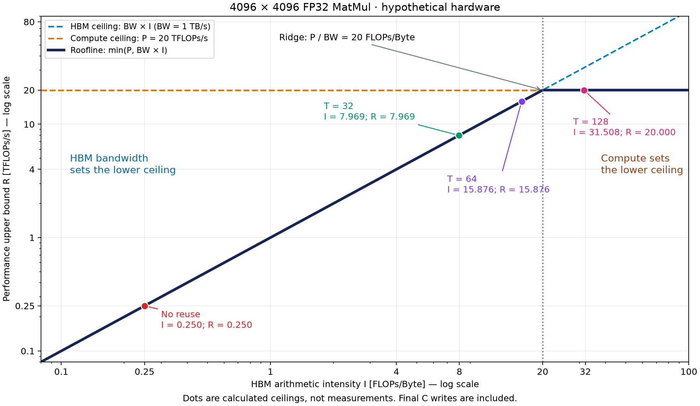

# ⑤ MatMul 손계산: 재사용 없음과 32·64·128 타일

> **한 줄 답.** 같은 약 137.439 GFLOPs를 수행해도 HBM 이동량은 약 549.823 GB에서 4.362 GB까지 줄어든다. 이상적 시간은 549.823 ms에서 6.872 ms로 줄지만, 128 타일에서는 연산 성능이 한계다.

이전 ← [④ 타일 크기](./04-tile-size-and-occupancy.md) · [4주차 목차](./README.md)

## 1. 문제와 가정

$$
A,B,C\in\mathbb{R}^{4096\times4096},\qquad C=A@B
$$

| 항목 | 조건 |
|---|---|
| 크기 | M = N = K = 4096, 이하 정사각 행렬 한 변을 N으로 표기 |
| 자료형 | 입력·중간 합·출력 모두 FP32, 원소당 4 Byte |
| 연산량 관례 | 곱셈 + 누산 덧셈 = 2 FLOPs, FMA도 2 FLOPs |
| 적용 가능한 최대 연산 성능 P | 20 × 10¹² FLOPs/s |
| HBM 대역폭 BW | 1 × 10¹² Byte/s |
| 입력 위치 | 이미 장치 HBM에 있음, CPU 전송 시간 제외 |
| 중간 합 | 온칩에 계속 유지, HBM에 쓰거나 읽지 않음 |
| 출력 | 기존 C를 읽지 않음, 최종 C만 한 번 씀 |
| 재사용 범위 | 출력 타일 안에서만 재사용, 서로 다른 출력 타일 사이 캐시 재사용 없음 |
| 입력 버퍼 | A·B 조각 한 벌, K 조각 폭도 T |
| 기타 가정 | 추가 이동·spill·padding 없음, 연산과 이동의 충분한 중첩 |

모든 수치는 가상 조건이다. `1 GFLOPs = 10⁹ FLOPs`, `1 TFLOPs/s = 10¹² FLOPs/s`, `1 GB = 10⁹ Byte`, `1 KiB = 1024 Byte`, `1 ms = 10⁻³ s`로 구분한다.

## 2. 공통 연산량과 출력 쓰기

$$
F=2N^3=2\times4096^3
=137,438,953,472\ \mathrm{FLOPs}
$$

$$
Q_C=4N^2=67,108,864\ \mathrm{Byte}
$$

$$
t_{\mathrm{compute}}=\frac{137,438,953,472}{20\times10^{12}}
=0.0068719476736\ \mathrm{s}
=6.8719476736\ \mathrm{ms}
$$

F, 최종 C 쓰기, 연산 시간은 **네 경우 모두 같다.** FMA의 개수는 N³이지만 FLOPs는 그 두 배다.

## 3. 재사용 없음

곱셈은 N³번이고, 매번 A·B를 하나씩 읽는다. 읽은 스칼라는 해당 곱셈 후 재사용하지 않는다. 중간 합만 온칩에 남긴다.

$$
Q_0=\underbrace{N^3\times2\times4}_{\text{A와 B 읽기}}
+\underbrace{4N^2}_{\text{C 쓰기}}
=549,822,922,752\ \mathrm{Byte}
$$

$$
I_0=\frac{2N^3}{8N^3+4N^2}
=\frac{N}{4N+2}
\approx0.249969486\ \mathrm{FLOPs/Byte}
$$

$$
R_0=\min(20\times10^{12},\;1\times10^{12}\times I_0)
\approx0.249969486\times10^{12}\ \mathrm{FLOPs/s}
$$

메모리 시간은 `549.822922752 ms`이며 연산 시간보다 크다. 따라서 이 모델의 이상적 시간도 그 값이다.

## 4. 타일 안에서 재사용

출력 타일 수 `(N/T)²`, 타일당 K 단계 수 `N/T`, 단계당 입력 이동량 `8T² Byte`를 곱한다. [작은 타일 그림과 유도](./03-tiling.md)를 먼저 보면 이 계산을 따라가기 쉽다.

$$
Q_T=\left(\frac NT\right)^2\frac NT\times8T^2+4N^2
=\frac{8N^3}{T}+4N^2
$$

$$
I_T=\frac{2N^3}{8N^3/T+4N^2}
=\frac{NT}{4N+2T}
$$

T=64를 예로 들면 출력 타일은 64²=4,096개, 타일당 K 단계는 64번, 단계당 읽기는 32,768 Byte다.

$$
Q_{64}=4096\times64\times32768+67,108,864
=8,657,043,456\ \mathrm{Byte}
$$

전체 A를 한 번 읽고 끝나는 것은 아니다. 각 A 원소는 출력의 열 타일 수 N/T만큼, 각 B 원소는 행 타일 수 N/T만큼 HBM에서 읽는다. T=64에서는 각각 64회다.

## 5. FLOPs·HBM 이동량·산술 강도 비교

| 방식 | F (FLOPs) | A·B 읽기 (Byte) | C 쓰기 (Byte) | 총 Q (Byte) | 총 Q (GB) | I (FLOPs/Byte) |
|---|---:|---:|---:|---:|---:|---:|
| 재사용 없음 | 137,438,953,472 | 549,755,813,888 | 67,108,864 | 549,822,922,752 | 549.822923 | 0.249969 |
| T = 32 | 137,438,953,472 | 17,179,869,184 | 67,108,864 | 17,246,978,048 | 17.246978 | 7.968872 |
| T = 64 | 137,438,953,472 | 8,589,934,592 | 67,108,864 | 8,657,043,456 | 8.657043 | 15.875969 |
| T = 128 | 137,438,953,472 | 4,294,967,296 | 67,108,864 | 4,362,076,160 | 4.362076 | 31.507692 |

입력 읽기는 정확히 T배 줄지만, 총 Q에는 변하지 않는 C 쓰기가 포함된다. 따라서 I를 정확히 T/4로 두지 않는다. T/4는 출력 쓰기를 무시할 수 있을 때의 근사다.

## 6. Roofline 상한과 이상적 시간 비교

$$
R_{\mathrm{roof}}=\min(P,BW\times I),\qquad
t_{\mathrm{ideal}}=\max(F/P,Q/BW),\qquad I_*=20
$$

| 방식 | BW×I (TFLOPs/s) | Roofline 상한 (TFLOPs/s) | 연산 시간 (ms) | 메모리 시간 (ms) | 이상적 시간 (ms) | 모델상 제한 자원 | 재사용 없음 대비 시간 비율 t₀/t |
|---|---:|---:|---:|---:|---:|---|---:|
| 재사용 없음 | 0.249969 | 0.249969 | 6.871948 | 549.822923 | 549.822923 | HBM 대역폭 | 1.00배 |
| T = 32 | 7.968872 | 7.968872 | 6.871948 | 17.246978 | 17.246978 | HBM 대역폭 | 31.88배 |
| T = 64 | 15.875969 | 15.875969 | 6.871948 | 8.657043 | 8.657043 | HBM 대역폭 | 63.51배 |
| T = 128 | 31.507692 | 20.000000 | 6.871948 | 4.362076 | 6.871948 | 연산 성능 | 80.01배 |

표시는 소수점 아래 6자리로 반올림했다. 비율은 반올림 전 값으로 구했다. **이 비율은 두 이상적 시간의 비교이며 실측 speedup이 아니다.**

T=128에서 메모리는 약 4.362 ms 안에 데이터를 공급할 수 있어도, 계산에는 최소 약 6.872 ms가 필요하다. 따라서 메모리 시간을 그대로 실행시간으로 삼으면 안 된다. T=64에서 128로 키우면 이상적 시간은 8.657 ms에서 6.872 ms로 줄어, 약 **1.785 ms(20.6%) 감소**한다.

## 7. 입력 버퍼와 중간 합 비교

단일 입력 버퍼와 FP32 누산 기준이다. 타일 행은 **출력 타일 하나당**, 재사용 없음 행은 **출력 하나를 계산하는 최소 논리 단위당** 크기다.

| 방식 | 보관하는 A 입력 | 보관하는 B 입력 | 입력 합계 (Byte) | 중간 합 (Byte) | 논리적 총합 (Byte) |
|---|---:|---:|---:|---:|---:|
| 재사용 없음 | 1원소 = 4 B | 1원소 = 4 B | 8 | 4 | 12 |
| T = 32 | 32²원소 = 4,096 B | 32²원소 = 4,096 B | 8,192 (8 KiB) | 4,096 (4 KiB) | 12,288 (12 KiB) |
| T = 64 | 64²원소 = 16,384 B | 64²원소 = 16,384 B | 32,768 (32 KiB) | 16,384 (16 KiB) | 49,152 (48 KiB) |
| T = 128 | 128²원소 = 65,536 B | 128²원소 = 65,536 B | 131,072 (128 KiB) | 65,536 (64 KiB) | 196,608 (192 KiB) |

입력 버퍼와 중간 합은 다른 자원에 놓일 수 있고, 실제 레지스터·Shared Memory 할당량에는 추가 비용이 있다. 정확한 Occupancy는 주어진 P·BW만으로 구할 수 없다. 자원 부족으로 spill이 발생하거나 타일 자체가 실행 불가능할 수도 있다. [④ 타일 크기](./04-tile-size-and-occupancy.md)에서 이 제약을 설명한다.

## 8. 검산과 토론

- 모든 경우의 F가 같고, C 쓰기가 `67,108,864 Byte`로 같은가?
- 입력 읽기만 1/T로 줄였는가? 중간 합을 매 K 단계마다 HBM에 쓰는 항을 넣지는 않았는가?
- 시간 계산에서 GB와 GiB를 섞지 않았는가? 이 문제의 1 TB/s에서는 Q의 GB 숫자와 메모리 시간의 ms 숫자가 같다.
- 성능 상한에서 min을, 이상적 시간에서 max를 적용했는가?
- 한 변을 두 배로 할 때 입력 버퍼와 중간 합이 네 배가 되는가?

전체 A·B·C의 저장 용량은 `12N² = 201,326,592 Byte`(192 MiB)다. 이 용량과 표의 반복 HBM 이동량은 다른 값이다. 3주차의 “A·B를 전체에서 한 번만 읽기”를 적용하면 I=N/6≈682.667이지만, 이번 문제에서는 타일 사이 재사용을 제외했으므로 그 값을 사용할 수 없다.

**추가 손계산:** 출력 쓰기를 포함하여 I_T≥20을 풀면 `T≥80N/(N−40)`이다. N=4096에서는 약 80.789다. 32·64·128 중에서는 128만 이를 넘는다. 이 임계값은 Roofline의 경계이며 최적 타일 크기나 실행 가능성을 보장하지 않는다.

공식의 출발점은 [Scaling Book 1장의 시간·산술 강도 모델](https://jax-ml.github.io/scaling-book/roofline/)이다. 타일 안에서만 재사용한다는 사용자 지정 조건에 맞춰 이동량과 버퍼 크기를 직접 계산했다.
