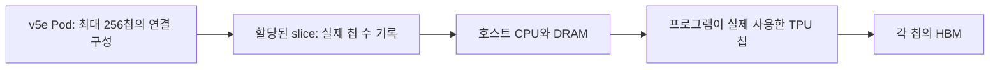

# ① 무엇을 비교할까: 칩·시스템·사용 목적

[5주차 목차](./README.md) · 다음 → [② 하드웨어](./02-hardware.md)

제품명을 정하기 전에 질문을 정한다. “행렬곱 한 번이 얼마나 빠른가?”, “동시에 들어오는 요청을 몇 개 처리하는가?”, “노트북에서 한 요청에 얼마의 에너지를 쓰는가?”는 서로 다른 실험이다.

## 1. 이번 주의 조사 대상

| 제조사·제품·세대 | 비교할 연산 자원 | 실행 환경 | 이번 조사 상태 |
|---|---|---|---|
| NVIDIA H100 **SXM**, Hopper | 전체 GPU 1개 사용을 가정. MIG 분할 여부는 실습 때 확인 | CPU 호스트가 있는 서버 | 문헌 조사. 서버 구성·실행 버전·성능은 아직 미측정 |
| Google TPU **v5e** | TPU 칩 1개 사용을 가정 | Cloud TPU 호스트와 가속기 | 문헌 조사. 실제 할당 slice·호스트·소프트웨어는 미확인 |
| Intel Core Ultra **9 288V**, Series 2 / Lunar Lake, Intel AI Boost NPU | 프로세서에 통합된 NPU 1개 | CPU·GPU·NPU를 포함한 개인 기기 | 문헌 조사. 노트북 모델·OS·드라이버·실행 성능은 미확인 |

제품·폼팩터는 [H100 사양](https://www.nvidia.com/en-us/data-center/h100/), [TPU v5e 문서](https://docs.cloud.google.com/tpu/docs/v5e), [288V 사양](https://www.intel.com/content/www/us/en/products/sku/240961/intel-core-ultra-9-processor-288v-12m-cache-up-to-5-10-ghz/specifications.html)을 기준으로 한다. 설치 버전 기록 항목은 [④](./04-software.md)에 있다.

NPU는 신경망 가속기를 가리키는 넓은 이름이고 TPU도 신경망용 가속기다. 여기서 GPU·TPU·NPU라는 세 열은 **세 제품 사례의 약칭**이다. 스마트폰 NPU, 다른 Intel 세대, 다른 제조사의 GPU에 그대로 적용하지 않는다.

## 2. 칩 하나와 시스템 하나는 다르다

v5e 문서의 기본 시스템 표는 **칩당 HBM**, **호스트당 8칩**, **Pod당 256칩**을 구분한다. serving에는 1·4·8칩 slice 구성이 있다. 전체 Pod 사양이 내 프로그램에 할당된 자원이 되는 것은 아니다. [Google: v5e System architecture / Configurations](https://docs.cloud.google.com/tpu/docs/v5e)

이 그림은 **자원 범위**를 나타낸다. 여러 호스트를 쓰는 slice의 물리 배선도는 아니다. 기록할 수는 세 가지다: 물리 시스템에 있는 장치 수, 할당받은 수, 연산에 사용한 수. 8칩을 할당받아 한 칩만 사용했다면 둘 다 적는다.

장치별 peak를 더한 값은 집계된 이론값이다. 실제 처리량에는 분할 방식·통신·불균형·호스트 작업이 영향을 준다. 8개 장치의 시간을 8로 나누거나 처리량을 8로 나눠 단일 장치의 실측값으로 바꿀 수 없다.

## 3. 같은 질문 안에서 비교하기

| 비교 목적 | 맞출 조건 | 이 비교만으로 알 수 없는 것 |
|---|---|---|
| 같은 연산의 커널 | 식·shape·값·자료형·희소성·메모리 경계·완료 기준 | 다른 모델의 품질·서비스 처리량 |
| 같은 모델의 추론 | 가중치·입력·품질 목표·전처리·출력·배치·실행 범위 | 학습 수렴 시간 |
| 서비스 처리량 | 모델·품질·요청 분포·동시성·지연시간 제한·장치 수 | 한 요청의 최소 지연시간 |
| 개인 기기의 추론 | 품질·응답시간·전력 모드·기기 전체 에너지·열 상태 | 데이터센터의 확장 효율 |
| 학습 | 데이터·정밀도·optimizer·목표 품질까지의 step 수·통신 | 같은 제품의 추론 성능 |

이번 공통 과제는 **역전파 없는 고정 shape 추론**이다. 배치 1과 128도 각각 따로 비교한다. 배치 128 결과를 배치 1 요청의 지연시간으로 해석하지 않는다.

## 4. 두 종류의 공정성

**커널 비교는 계산 조건을 고정한다.** 예를 들어 X·W가 BF16이고 FP32로 누산한 뒤 FP32 bias·ReLU·출력을 사용한다면, 입력 파일이 FP32라는 이유만으로 동등하다고 볼 수 없다. 이 정밀도 계약을 지원하는지부터 확인한다.

**모델·시스템 비교는 품질과 사용 조건을 고정한다.** 내부에서는 BF16·FP16·INT8 경로가 다를 수 있다. 대신 같은 평가 데이터와 사전 합의한 품질 기준을 통과해야 한다. 양자화·장치 분담·호스트 전송도 결과의 일부다.

“A가 빠르다”를 다음처럼 바꿔 쓰면 검증할 수 있다.

> A 제품 1개, 해당 소프트웨어 버전, 배치 128, 지정한 정밀도와 오차 기준에서, 준비 실행 후 장치 상주 입력의 동기화된 호출 시간이 B보다 짧았다.

현재 자료에는 이 문장을 완성할 실측값이 없다. 제품 사양으로 어느 조건을 조사해야 하는지 정하고, 실제 실행으로 빈칸을 채운다.
