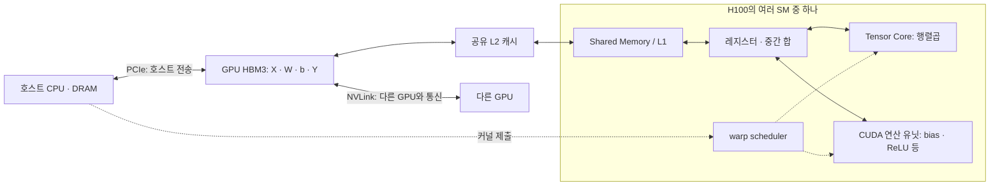
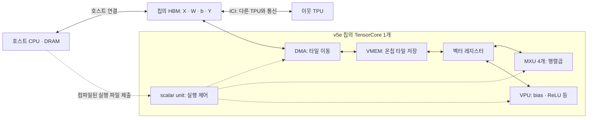
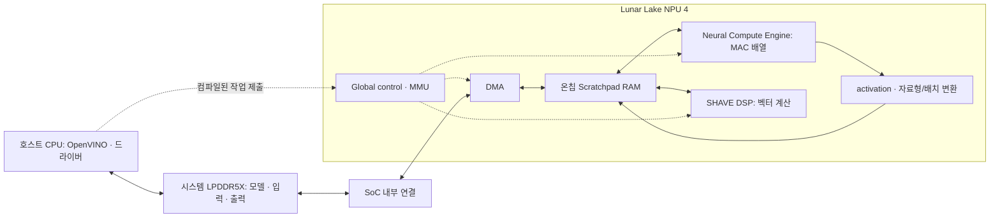

# ② 계산과 데이터 이동은 누가 맡을까?

[5주차 목차](./README.md) · 이전 → [① 비교 단위](./01-comparison-scope.md) · 다음 → [③ 사양](./03-specifications.md)

아래 그림은 실행을 이해하기 위한 개념도다. 실선은 데이터 경로, 점선은 제어 관계다. 상자는 면적·성능에 비례하지 않으며, 특정 커널이 모든 단계를 그대로 거친다는 보장은 없다.

## 1. NVIDIA H100 SXM: SM 안에 여러 역할이 있다

CUDA 커널의 thread block이 SM에 배치되고, scheduler가 실행 가능한 warp에 명령을 발행한다. Tensor Core는 SM 안의 행렬곱 장치다. bias·ReLU는 일반 연산 유닛에서 처리할 수 있다. 컴파일러나 라이브러리가 이를 같은 커널의 후처리로 합칠 수도 있다. [CUDA Programming Model](https://docs.nvidia.com/cuda/cuda-programming-guide/01-introduction/programming-model.html), [Scaling Book: GPU 구성과 TPU 대응](https://jax-ml.github.io/scaling-book/gpus/)

타일과 Shared Memory 사용은 커널·컴파일러가 결정하고 캐시는 하드웨어가 관리한다. H100의 TMA는 메모리 복사를 돕는다. **자동 캐시 재사용과 명시적으로 보관한 타일은 구분**한다. H100의 L1·Shared Memory 결합 용량 256 KB와 사용 가능한 Shared Memory 최대 228 KB/SM도 같은 값이 아니다. [Hopper Tuning Guide: TMA / Memory System](https://docs.nvidia.com/cuda/hopper-tuning-guide/index.html)

## 2. Google TPU v5e: TensorCore 안에 MXU·벡터·제어 장치가 있다

v5e는 칩당 TensorCore 하나와 MXU 네 개를 갖는다. [Google: v5e System architecture](https://docs.cloud.google.com/tpu/docs/v5e)

MXU가 행렬곱을, VPU가 원소별 계산을, scalar unit이 제어를 담당하는 구조다. 컴파일러가 타일 이동과 계산의 겹침을 계획한다. VMEM은 GPU L2와 달리 명시적인 작업 버퍼로 설명되며, 구체적인 배치는 XLA 또는 Pallas 프로그램에 달려 있다. [Scaling Book 2장: What Is a TPU?](https://jax-ml.github.io/scaling-book/tpus/)

**GPU Tensor Core는 행렬곱 하위 장치, TPU TensorCore는 MXU·VPU 등을 묶는 상위 단위**다. 이름을 보고 코어 개수를 직접 비교하지 않는다. 또한 TPU의 SMEM은 scalar memory를 뜻할 수 있어 GPU의 Shared Memory 약칭과 혼동하지 않는다. [Scaling Book 12장](https://jax-ml.github.io/scaling-book/gpus/), [2장](https://jax-ml.github.io/scaling-book/tpus/)

## 3. Intel Core Ultra 9 288V NPU: SoC 안의 추론 엔진

Intel의 NPU 4 자료에는 MAC 배열, activation·변환 파이프라인, SHAVE DSP, DMA, Scratchpad RAM이 구분되어 있다. 행렬곱은 MAC 배열, ReLU는 activation 경로 등으로 처리할 수 있지만 **이번 그래프의 실제 배치는 컴파일 결과로 확인**한다. [Intel Lunar Lake AI Hardware Accelerators, 슬라이드 25–35](https://cdrdv2-public.intel.com/824436/2024_Intel_Tech%20Tour%20TW_Lunar%20Lake%20AI%20Hardware%20Accelerators.pdf)

OpenVINO NPU 컴파일러가 연산 배치와 메모리 이동을 최적화한다. Python 사용자가 MAC 배열의 타일마다 직접 명령을 발행하는 API와는 구분된다. [OpenVINO 2026: NPU Device 도입부](https://docs.openvino.ai/2026/openvino-workflow/running-inference/inference-devices-and-modes/npu-device.html)

여기에는 H100처럼 별도 가속기 HBM으로 복사하는 그림을 적용하지 않는다. 공유 시스템 메모리를 쓰더라도 온칩 버퍼로의 이동·layout 변환·동기화·런타임 복사가 사라지는 것은 아니다. 따라서 “통합 NPU이므로 전송 시간은 0”이라고 가정하지 않는다.

## 4. 지난주의 Tiling으로 읽기

| 질문 | H100 SXM | TPU v5e | 288V NPU |
|---|---|---|---|
| 큰 텐서가 있는 메모리 | HBM | HBM | 공유 시스템 메모리 |
| 가까운 데이터 재사용 공간 | 캐시·Shared Memory·레지스터 | VMEM·벡터 레지스터 | Scratchpad·엔진 내부 저장 공간 |
| 이동과 실행을 누가 계획하는가? | 커널·컴파일러·라이브러리와 하드웨어 scheduler/캐시 | XLA/Pallas와 DMA·제어 장치 | NPU 컴파일러와 런타임·DMA·제어 장치 |
| 이번에 확인할 것 | 타일·fusion·캐시 hit·spill | 타일·padding·VMEM 사용·fusion | 컴파일 지원·배치·변환·실제 장치 실행 |

이 표는 위 자료의 역할을 학습용으로 대응시킨 것이다. 어느 쪽도 “행렬곱만 하는 장치”로 설명하지 않는다. 그리고 큰 메모리에서 읽는 Byte와 온칩에서 다시 쓰는 Byte를 같은 Roofline 분모에 섞지 않는다.
