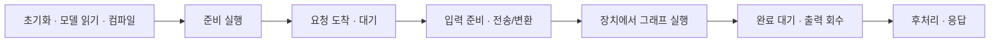

# ⑤ 실제로 빠르다는 뜻: 무엇의 시간을 재었을까?

[5주차 목차](./README.md) · 이전 → [④ 소프트웨어](./04-software.md) · 다음 → [⑥ 조건표·계산](./06-comparison-exercise.md)

장치의 계산 시간은 사용자가 기다린 시간의 일부다. 서로 다른 범위의 시간을 같은 열에 넣으면 비교가 어긋난다.

## 1. 시간의 시작과 끝

직렬 경로를 보여주는 그림이다. 비동기 서비스에서는 전송·계산·다른 요청이 겹칠 수 있으므로 각 시간을 무조건 합산하지 않는다.

| 측정 범위 | 시작 → 끝 | 포함·제외를 기록할 내용 |
|---|---|---|
| 초기 준비 | 모델 읽기/초기화 전 → 컴파일·첫 실행 완료 | 컴파일 캐시 hit/miss, 가중치 변환·업로드, 첫 실행을 분리했는지 |
| 장치 그래프 시간 | 장치에서 첫 연산 시작 → 마지막 연산 완료 | MatMul만인지 bias·ReLU까지인지, device event/profiler, 그래프 내부 복사 |
| 동기화된 호출 시간 | 호스트에서 호출 직전 → 장치 완료 확인 | 입력·가중치 상주. dispatch·런타임·완료 대기 포함. 출력의 호스트 복사는 제외 |
| 정상 상태 전체 요청 | 호스트 입력 준비됨 → 호스트 출력 사용 가능 | 입력 전송·변환·실행·출력 회수. 이미 상주한 W·b의 최초 로드는 별도 |
| 서비스 응답 | 요청 도착 → 응답 완료 | queue·batch 대기·전후처리·네트워크 경계까지 명시 |

GPU event로 얻은 시간과 JAX `block_until_ready()`를 포함한 호스트 시간을 바로 비교하지 않는다. NPU에 동등한 장치 타이머가 없다면 세 장치 모두 **동기화된 호출 시간**이나 **전체 요청 시간**처럼 공통으로 구현 가능한 범위로 맞춘다. 순수 장치 시간은 미측정으로 남긴다. 비동기 완료의 의미는 [CUDA 문서](https://docs.nvidia.com/cuda/cuda-programming-guide/02-basics/asynchronous-execution.html)와 [JAX JIT 문서](https://docs.jax.dev/en/latest/jit-compilation.html)를 참고한다.

## 2. 배치 지연시간과 처리량

이 과제에서 X의 **한 행을 sample 하나**, M행의 호출을 **batch 하나**로 정의한다.

$$
\text{batch latency}=t_M\ [\mathrm{ms/batch}],\qquad
\text{samples/s}=\frac{R\times M}{T\ [\mathrm{s}]}
$$

R은 완료한 batch 수, T는 해당 전체 측정 구간이다. 미완료 작업을 모두 기다린 뒤 끝낸다. 순차적으로 하나씩 실행한 경우에만 평균 batch 시간으로부터 `1000M / 평균 t_M(ms)`를 구할 수 있다.

| 배치 | 지연시간 기록 | 처리량 기록 | 해석할 때 주의할 점 |
|---|---|---|---|
| M=1 | μs 또는 ms / 1-sample batch, p50·p95 등 | samples/s, 요청 하나=한 행이면 requests/s도 가능 | 작은 작업은 제출·동기화 비용이 지배할 수 있음 |
| M=128 | μs 또는 ms / 128-sample batch, p50·p95 등 | samples/s와 batches/s를 구분 | `t₁₂₈ / 128`은 분담된 시간이며 한 요청이 기다린 시간이 아님 |

예를 들어 **가상의** 배치 시간이 1행에 1 ms, 128행에 4 ms라면 처리량은 각각 1,000과 32,000 samples/s다. 후자는 128행이 함께 끝날 때까지 4 ms를 기다린다. 온라인 요청을 모아서 처리했다면 batch가 차기를 기다린 시간도 추가된다.

동시 요청 수는 batch 크기와 다르다. 순차 지연시간 측정과 여러 요청을 겹친 최대 처리량 실험은 별도 행으로 기록한다. p50의 역수로 서비스 전체 처리량을 계산하지 않는다.

## 3. 실행할 때 사용할 측정 절차

아래는 교육용 제안이며 MLPerf 규칙 자체가 아니다.

1. 입력·가중치·품질 계약과 측정 범위를 먼저 고정한다. 두 shape를 각각 컴파일하고 준비 시간을 별도로 기록한다.
2. 준비 실행 횟수와 안정화 상태를 기록한다. 예를 들어 20회 실행 후 측정하되 이 횟수가 모든 장치에 충분하다고 가정하지 않는다.
3. 순차 지연시간은 매 호출의 완료를 기다려 원시 시간을 저장한다. 예를 들어 1,000회를 측정하고 표본 수·평균·p50·p95를 기록한다. p99는 충분한 표본과 반복 측정이 있는지 함께 판단한다.
4. 처리량은 동시성·요청 생성 방식·전체 완료 수·측정 구간을 기록한다. 마지막 작업까지 완료한 뒤 종료한다.
5. 오차 검증과 출력 복사 자체를 어느 시간에 넣었는지 밝힌다. 보통 정상 상태 호출 측정 밖에서 검증한다.
6. 반복 실행의 캐시·클록·열·전력 모드와 다른 작업의 간섭을 기록한다. 원시 기록을 남기고 실패한 결과도 표시한다.

우리 W는 BF16이면 **2 MiB**다. H100 L2의 공시 용량보다 작으므로 반복 실행에서는 가중치가 캐시에 남을 가능성이 있다. 따라서 매 호출마다 W 전체를 HBM에서 읽는 손계산은 **그 이동 가정 아래의 모델**이다. 실측에 적용하려면 캐시 상태·메모리 트래픽을 확인한다. [Hopper Tuning Guide: L2](https://docs.nvidia.com/cuda/hopper-tuning-guide/index.html)

## 4. MLPerf 결과표 읽기

MLPerf는 칩의 peak 순위가 아니라 **특정 모델·품질·부하에서 측정한 시스템 결과**를 제공한다. 다음 열을 함께 확인한다. [MLPerf Datacenter: Submission Information](https://mlcommons.org/benchmarks/inference-datacenter/)

| 먼저 확인할 항목 | 비교에서의 의미 |
|---|---|
| 제출 round·규칙 버전 | 서로 다른 버전에서 바뀐 모델·품질·시나리오를 섞지 않음 |
| 모델·데이터셋·품질 목표 | 같은 이름의 모델도 품질 목표가 다른 결과가 있을 수 있음 |
| Scenario·metric | 응답시간 제한을 지킨 처리량인지, Offline 처리량인지 확인 |
| Division | Closed는 기준 모델 제약, Open은 모델 변경·재학습 등을 허용하는 범위가 다름 |
| System·Accelerator and Count | CPU/가속기 종류·개수·연결과 실행 환경 |
| Software·Details·Code | 프레임워크·라이브러리·구현·재현 조건 |
| Availability | Available / Preview / RDI 등 결과의 공급 상태 |

현재 규칙에서 **Server**는 요청 도착 패턴과 지연시간 제한을 만족하는 처리량을, **Offline**은 미리 주어진 작업의 처리량을 평가한다. 모델에 따라 필요한 scenario가 다르고 Interactive 등의 조건도 있으므로 해당 round의 규칙을 읽는다. 배치 1 실험을 곧바로 MLPerf Single Stream, 배치 128을 곧바로 Offline이라고 부르지 않는다. [MLPerf Inference Rules: Scenarios](https://github.com/mlcommons/inference_policies/blob/master/inference_rules.adoc)

Closed도 모든 제출이 같은 내부 정밀도·같은 batch·같은 커널을 사용한다는 뜻은 아니다. 우리 조건표는 비교 원칙을 배우는 연습이며, 이 작은 연산을 실행했다고 MLPerf 점수가 되는 것은 아니다.

## 5. 선택: LLM과 에너지

LLM의 **TTFT**는 요청부터 첫 토큰까지의 시간이고, 전체 출력 토큰 처리량은 동시에 처리한 요청들의 출력 토큰 수를 측정 구간으로 나눈 값이다. 전자는 한 사용자의 기다림, 후자는 시스템의 처리 능력을 보여준다. 입력·출력 길이, 동시성, streaming, percentile을 맞춰야 한다. 높은 tokens/s만으로 TTFT가 짧다고 결론 내릴 수 없다. [NVIDIA NIM LLM Benchmarking: Metrics](https://docs.nvidia.com/nim/benchmarking/llm/latest/metrics.html)

$$
E=\int_{t_0}^{t_1}P(t)\,dt\ [\mathrm{J}],\qquad
E_{\mathrm{sample}}=\frac{E}{\text{완료한 sample 수}}
$$

전력은 W, 작업당 에너지는 J/sample이다. 장치 센서·CPU 패키지·벽면 전체 시스템 중 어느 경계인지, idle 전력을 빼는지, 측정 구간과 샘플링 간격을 적는다. MLPerf Power의 시스템 전력은 성능 측정 동안의 **벽면 AC 전력**을 대상으로 하며 TDP를 측정값으로 인정하는 방식이 아니다. [MLPerf: Power Measurements](https://mlcommons.org/benchmarks/inference-datacenter/)

H100의 GPU 전력, TPU 칩 전력, 288V 전체 프로세서 전력을 섞으면 NPU 단독 효율 비교가 되지 않는다. 이번 자료에서 실제 작업당 에너지는 세 제품 모두 **아직 미측정**이다.
